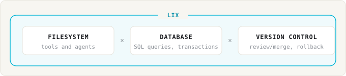

<p align="center">
  
</p>

<h3 align="center">Version control system and SQL database in one</h3>

<p align="center">
  <a href="https://www.npmjs.com/package/@lix-js/sdk"></a>
  <a href="https://discord.gg/gdMPPWy57R"></a>
  <a href="https://github.com/opral/lix"></a>
  <a href="https://x.com/lixCCS"></a>
</p>

AI applications span files, a SQL database, and version control. Lix combines those three requirements in one system, avoiding three separate layers of infrastructure that need to be kept in sync. One storage, one transaction boundary, one API. Much simpler to manage.



- 📄 **Works with any file format.** Plugins map DOCX, CSV, Markdown, or your own format to versioned entities.
- 🔍 **Semantic changes.** Review the clause, cell, or row that changed, not lines of bytes.
- 🗄️ **SQL and transactions.** Query file content, app data, and history; update files and rows in one ACID transaction.
- 👥 **Real-time collaboration.** People and agents share a repository and see changes live.
- 🔌 **Pluggable storage.** An S3 bucket, the local filesystem, or OPFS in the browser: Lix is easy to embed and scale, in contrast to existing VCS like Git that assume a local POSIX filesystem.
- 🔐 **Permissions (soon).** Finance, legal, and contractors need different access. Permissions will live inside the repository: per file, per group, and versioned like any other change.

## Getting started

<p>
   JavaScript ·
  <a href="https://github.com/opral/lix/issues/373" title="The Python SDK is planned. Upvote the issue on GitHub."> Python</a> ·
  <a href="https://github.com/opral/lix/issues/371" title="The Rust SDK is planned. Upvote the issue on GitHub."> Rust</a> ·
  <a href="https://github.com/opral/lix/issues/370" title="The Go SDK is planned. Upvote the issue on GitHub."> Go</a>
</p>

```bash
npm install @lix-js/sdk
```

Run locally with `LocalFilesystem`:

```ts
import { LocalFilesystem, openLix } from "@lix-js/sdk";

const lix = await openLix({
  storage: new LocalFilesystem({ path: "./workspace", syncAllFiles: true }),
});

await lix.execute("INSERT INTO lix_file (path, content) VALUES ($1, $2)", [
  "/notes/status.txt",
  new TextEncoder().encode("ready"),
]);
```

Or against a server:

```ts
const lix = await openLix({
  server: {
    mode: "remote",
    url: "https://example.com/workspaces/acme",
  },
});
```

## Prime use cases

### Give customers a repository

Your product gives every customer their own repository: their files, their data, and the automations LLMs now write for them. Lix is simpler than git here: it embeds in your product, and your customers review and undo changes without branch, merge, or pull request vocabulary.


```ts
// One repository per customer, on your storage.
const lix = await openLix({
  storage: new S3Storage({ bucket: `customer-${customer.id}` }),
});

// The agent writes an automation. Lix records the change, no commit needed.
await lix.execute("INSERT INTO lix_file (path, content) VALUES ($1, $2)", [
  "/automations/booking.ts",
  code,
]);

// Your UI shows the diff. The customer clicks accept or undo.
```

### Apps with version control

Build apps on a repository instead of a bare database. The app reads and writes SQL rows and normal files. History, review, rollback, and isolated branches for agents come from the substrate instead of app code.


App logic is plain SQL. History comes with it:

```ts
// A normal app write. Lix records the change automatically.
await lix.execute("UPDATE orders SET status = 'shipped' WHERE id = 1002");

// The history sidebar, diff view, and undo button are queries:
const changes = await lix.execute(`
  SELECT created_at, schema_key, entity_pk, snapshot_content
  FROM lix_change
  ORDER BY created_at DESC
`);
```

Update Lix files and rows in one ACID transaction. Lix records the history automatically.

[Read more about semantic changes →](https://lix.dev/docs/semantic-changes)

## How Lix works

### Files × database

Plugins map files to SQL rows. A paragraph, cell, or property becomes a row Lix can version.

The file stays a normal file on disk. The rows are queryable with SQL. Lix tracks every change to both.


### Runs in-process as part of your infrastructure

Lix runs in-process with pluggable storage: in memory, on the local filesystem, or on an S3 bucket. Mix and match however it serves your infrastructure.


Existing VCS like Git assume a local POSIX filesystem, which makes them hard to embed and scale. See the [Persistence and Storage](https://lix.dev/docs/persistence) docs.

## Comparison

Git tracks files but has no SQL. PostgreSQL/SQLite have SQL but no files and no change history. Lix has all three.


| Capability                    | Lix            | Git                | PostgreSQL / SQLite |
| ----------------------------- | -------------- | ------------------ | ------------------- |
| Files                         | ✅             | ✅                 | ❌                  |
| SQL and transactions          | ✅             | ❌                 | ✅                  |
| Branches and merging          | ✅             | ✅                 | ❌                  |
| Diffs by cell, clause, or row | ✅ via plugins | ❌ text lines only | ❌                  |
| Pluggable storage             | ✅             | ❌                 | ❌                  |

## Learn more

- **[Getting Started Guide](https://lix.dev/docs/getting-started)** - Build your first app with Lix
- **[Documentation](https://lix.dev/docs)** - Full API reference and guides
- **[Discord](https://discord.gg/gdMPPWy57R)** - Get help and join the community
- **[GitHub](https://github.com/opral/lix)** - Report issues and contribute

## License

[MIT](./LICENSE)
