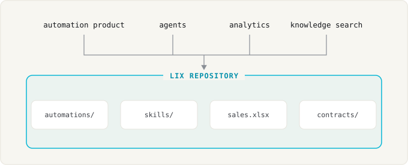

<p align="center">
  
</p>

<h3 align="center">A version control system for files and data beyond code</h3>

<p align="center">
  <a href="https://www.npmjs.com/package/@lix-js/sdk"></a>
  <a href="https://discord.gg/gdMPPWy57R"></a>
  <a href="https://github.com/opral/lix"></a>
  <a href="https://x.com/lixCCS"></a>
</p>

Agents and tools work with files. Applications need a database. Teams need version control. Lix combines all three: normal files for tools, SQL rows for apps, and version control for every change.


- 📄 **Works with any file format.** Plugins map DOCX, CSV, Markdown, or your own format to versioned entities.
- 🔍 **Semantic changes.** Review the clause, cell, or row that changed, not lines of bytes.
- 🗄️ **SQL and transactions.** Query file content, app data, and history; update files and rows in one ACID transaction.
- 👥 **Real-time collaboration.** People and agents share a repository and see changes live.
- 🔌 **Pluggable storage.** An S3 bucket, the local filesystem, or OPFS in the browser: Lix is easy to embed and scale, in contrast to existing VCS like Git that assume a local POSIX filesystem.
- 🔐 **Permissions (soon).** Finance, legal, and contractors need different access. Permissions will live inside the repository: per file, per group, and versioned like any other change.

## Try a demo app

[Flashtype](https://flashtype.ai) is a Markdown editor for Claude and Codex built on Lix. Open local Markdown files, let agents edit them, review changes as diffs, and restore previous versions from history.

[](https://flashtype.ai)

## Getting started

<p>
   JavaScript ·
  <a href="https://github.com/opral/lix/issues/373" title="The Python SDK is planned. Upvote the issue on GitHub."> Python</a> ·
  <a href="https://github.com/opral/lix/issues/371" title="The Rust SDK is planned. Upvote the issue on GitHub."> Rust</a> ·
  <a href="https://github.com/opral/lix/issues/370" title="The Go SDK is planned. Upvote the issue on GitHub."> Go</a>
</p>

```bash
npm install @lix-js/sdk
```

Run locally with `LocalFilesystem`:

```ts
import { LocalFilesystem, openLix } from "@lix-js/sdk";

const lix = await openLix({
  storage: new LocalFilesystem({ path: "./workspace", syncAllFiles: true }),
});

await lix.execute("INSERT INTO lix_file (path, content) VALUES ($1, $2)", [
  "/notes/status.txt",
  new TextEncoder().encode("ready"),
]);
```

Or against a server:

```ts
const lix = await openLix({
  server: {
    mode: "remote",
    url: "https://example.com/workspaces/acme",
  },
});
```

## Why Lix?

### Files × database

Plugins map files to SQL rows. A paragraph, cell, or property becomes a row Lix can version.


The file stays a normal file on disk. The rows are queryable with SQL. Lix tracks every change to both.

The SDK includes plugins for Markdown and CSV. Add a plugin for other formats, such as JSON, XLSX, DOCX, or PDF.

### Pluggable storage

Lix embeds in your product and runs on storage adapters: in memory, on the local filesystem, or on an S3 bucket.


Existing VCS like Git assume a local POSIX filesystem, which makes them hard to embed and scale. See the [Persistence and Storage](https://lix.dev/docs/persistence) docs.

### Comparison

Git versions files but cannot query them. PostgreSQL and SQLite query rows but have no files and no history. Lix does both.


| Capability                    | Git             | PostgreSQL / SQLite | Lix                 |
| ----------------------------- | --------------- | ------------------- | ------------------- |
| Normal files                  | Yes             | No                  | Yes                 |
| SQL and transactions          | No              | Yes                 | Yes                 |
| Branches and merging          | Yes             | No                  | Yes                 |
| Diffs by cell, clause, or row | Text lines only | No                  | Yes, via plugins    |
| Pluggable storage             | No              | No                  | Yes                 |

### Prime use cases

#### Automation repository for your customers

LLMs let your product write automations for customers. Automations are code, so every customer needs a repository. Lix is simpler than git here: it embeds in your product, and your customers review and undo changes without branch, merge, or pull request vocabulary.

```ts
// One Lix repository per customer, hosted on your server (for example backed by S3).
const lix = await openLix({
  server: {
    mode: "remote",
    url: "https://lix.example.com/customers/acme",
  },
});

// The agent writes an automation. Lix records the change, no commit needed.
await lix.execute("INSERT INTO lix_file (path, content) VALUES ($1, $2)", [
  "/automations/booking.ts",
  code,
]);

// Your UI shows the diff. The customer clicks accept or undo.
```

#### Give agents safe, isolated workspaces

Give each agent its own branch. The agent works with normal files while the main branch stays stable. Preview its work, then merge or discard it.

```ts
const main = await lix.activeBranchId();
const task = await lix.createBranch({ name: "Agent task" });

await lix.switchBranch({ branchId: task.id });
// Run the agent. Its file and SQL writes are isolated to this branch.

await lix.switchBranch({ branchId: main });
const preview = await lix.mergeBranchPreview({ sourceBranchId: task.id });

if (preview.conflicts.length === 0) {
  await lix.mergeBranch({ sourceBranchId: task.id });
}
```

#### Build file-based apps with SQL and version control

Build editors, knowledge bases, and document workflows on normal files. Use SQL for app logic and Lix for history, rollback, branches, merging, and review.

Plugins define the parts Lix tracks. You can review a change to a paragraph, cell, property, or row instead of only bytes and lines.

Query changes without reading every file:

```ts
const changes = await lix.execute(`
  SELECT created_at, schema_key, entity_pk, snapshot_content
  FROM lix_change
  ORDER BY created_at DESC
  LIMIT 20
`);
```

Update Lix files and rows in one ACID transaction. Lix records the history automatically.

[Read more about semantic changes →](https://lix.dev/docs/semantic-changes)

## Where this is going

The goal is one repository for everything a company produces. Contracts, spreadsheets, app data, agent output, and the automations non-engineers now write with LLMs get the same foundation: one history, queryable with SQL, safe to branch and merge.



## Learn more

- **[Getting Started Guide](https://lix.dev/docs/getting-started)** - Build your first app with Lix
- **[Documentation](https://lix.dev/docs)** - Full API reference and guides
- **[Discord](https://discord.gg/gdMPPWy57R)** - Get help and join the community
- **[GitHub](https://github.com/opral/lix)** - Report issues and contribute

## License

[MIT](./LICENSE)
