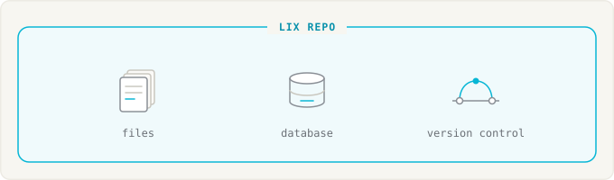
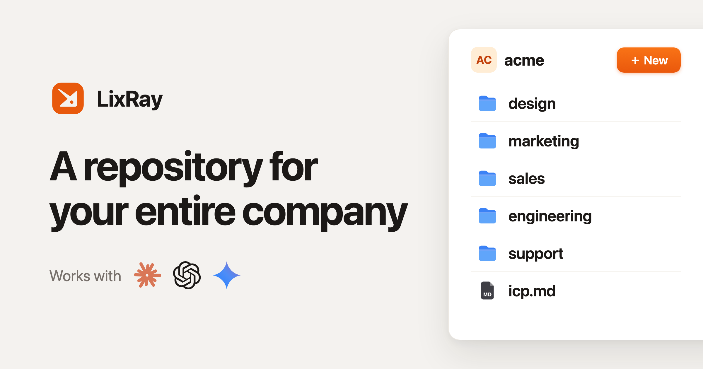
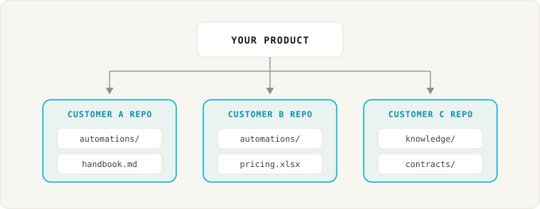
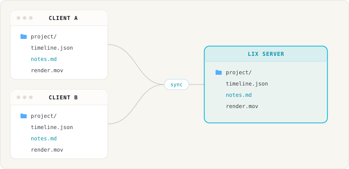
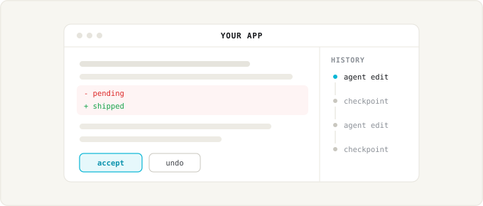
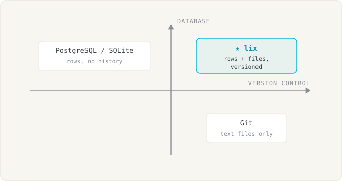

<p align="center">
  
</p>

<h3 align="center">Embeddable repository backend</h3>

<p align="center">
  <a href="https://www.npmjs.com/package/@lix-js/sdk"></a>
  <a href="https://discord.gg/gdMPPWy57R"></a>
  <a href="https://github.com/opral/lix"></a>
  <a href="https://x.com/lixCCS"></a>
</p>

Lix is a repository you embed in your product. Everything inside is versioned data: file content, app tables, reviews, comments. There is no external control plane to sync. Agents read and write normal files. Your product queries SQL. You branch, diff, merge, and roll back all of it together:



- 📄 **Files, in any format.** Store text and binary files. Plugins make supported formats queryable as versioned rows.
- 🗄️ **SQL database.** File content, app data, and history live in an ACID OLTP database. Query millions of rows with SQL.
- 🔀 **Version control.** Diffs name the clause, cell, or row that changed, not a byte blob. Review, merge, and roll back.
- ⚡ **Real-time collaboration.** People and agents share a repository and see changes as they happen.
- 🧩 **Pluggable storage.** Local filesystem, SQLite on browser OPFS, or S3 behind a Lix server.
- 🔒 **Permissions (soon).** Finance, legal, and contractors need different access. Permissions will live inside the repository: per file, per group, and versioned like any other change.

## Getting started

<p>
  <a href="https://lix.dev/docs/javascript-quickstart"> JavaScript</a> ·
  <a href="https://lix.dev/docs/rust-quickstart"> Rust</a> ·
  <a href="https://github.com/opral/lix/issues/373" title="The Python SDK is planned. Upvote the issue on GitHub."> Python</a> ·
  <a href="https://github.com/opral/lix/issues/370" title="The Go SDK is planned. Upvote the issue on GitHub."> Go</a>
</p>

```bash
npm install @lix-js/sdk @lix-js/storage-filesystem
```

Run locally with `FilesystemStorage`:

```ts
import { openLix } from "@lix-js/sdk";
import { FilesystemStorage } from "@lix-js/storage-filesystem";

const lix = await openLix({
  storage: new FilesystemStorage({ path: "./repository" }),
});

await lix.execute("INSERT INTO lix_file (path, content) VALUES ($1, $2)", [
  "/notes/status.txt",
  new TextEncoder().encode("ready"),
]);
```

Or against a server:

```ts
const lix = await openLix({
  server: {
    mode: "remote",
    url: "https://example.com/repositories/acme",
  },
});
```

## Try a demo

Try out [lixray.com](https://lixray.com):

<a href="https://lixray.com"></a>

## Prime use cases

### Give each customer a repository

Your product gives every customer their own repository: their files, their data, and the automations LLMs now write for them.

Lix handles any file format, collaborates in real time, and embeds in your product. Non-technical users get accept and undo, not branches and pull requests. Permissions are coming.



```ts
// One hosted repository per customer.
const lix = await openLix({
  server: {
    mode: "remote",
    url: `https://example.com/repositories/${customer.id}`,
  },
});

// The agent writes an automation. Lix records the change, no commit needed.
await lix.execute("INSERT INTO lix_file (path, content) VALUES ($1, $2)", [
  "/automations/booking.ts",
  code,
]);

// Your UI shows the diff. The customer clicks accept or undo.
```

### Sync files

Sync the files that coding agents and applications work on, between machines and with a server.



```ts
import { openLix } from "@lix-js/sdk";
import { FilesystemStorage } from "@lix-js/storage-filesystem";

// ./project stays a normal directory. Lix syncs it through the server.
const lix = await openLix({
  storage: new FilesystemStorage({ path: "./project" }),
  server: {
    mode: "remote",
    url: "https://lixray.com/@acme/project",
  },
});
```

Use [LixRay](https://lixray.com) or [run your own server](./docs/hosting.md).

### Apps with version control

Your app reads and writes SQL rows and normal files. Lix records every change with its author, so history, blame, branching, and rollback are queries instead of features you build.



```ts
// A normal app write. Lix records the change automatically.
await lix.execute("UPDATE orders SET status = 'shipped' WHERE id = 1002");

// The history sidebar, diff view, and undo button are queries:
const changes = await lix.execute(`
  SELECT created_at, account_id, schema_key, row_pk, snapshot_content
  FROM lix_change
  ORDER BY created_at DESC
`);
```

Files and rows update in one ACID transaction.

[Read more about diffs →](https://lix.dev/docs/diffs)

## How Lix works

### Files × database

Plugins map files to SQL rows. A paragraph, cell, or property becomes a row Lix can version.

With `FilesystemStorage`, the file stays available on disk. Its rows are queryable with SQL. Lix tracks changes to both.


### Runs in-process as part of your infrastructure

Lix runs in-process with pluggable storage: in memory, on the local filesystem, or in a server backed by S3.


Existing VCS like Git assume a local POSIX filesystem, which makes them hard to embed and scale. See the [Persistence and Storage](https://lix.dev/docs/persistence) docs.

## Comparison

Git tracks files but has no SQL. PostgreSQL/SQLite have SQL but no files and no change history. Lix has all three.



| Capability                    | Lix            | Git                | PostgreSQL / SQLite |
| ----------------------------- | -------------- | ------------------ | ------------------- |
| Normal files                  | ✅             | ✅                 | ❌                  |
| SQL and transactions          | ✅             | ❌                 | ✅                  |
| Branches and merging          | ✅             | ✅                 | ❌                  |
| Diffs by cell, clause, or row | ✅ via plugins | ❌ text lines only | ❌                  |
| Pluggable storage             | ✅             | ❌                 | ❌                  |

## Learn more

- **[Getting Started Guide](https://lix.dev/docs/getting-started)** - Build your first app with Lix
- **[Documentation](https://lix.dev/docs)** - Full API reference and guides
- **[Discord](https://discord.gg/gdMPPWy57R)** - Get help and join the community
- **[GitHub](https://github.com/opral/lix)** - Report issues and contribute

## License

[MIT](./LICENSE)
