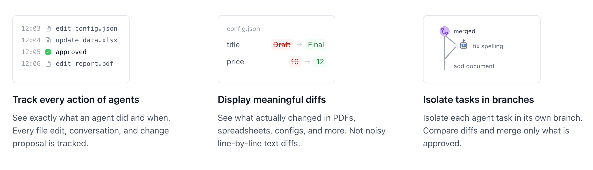

# Introducing Lix: A universal version control system

## AI agents need version control beyond text

Changes AI agents make need to be reviewable by humans.

For code, Git solves this:

- **Reviewable diffs**: What exactly did the agent change?
- **Human-in-the-loop**: Review, then merge or reject.
- **Rollback changes**: Undo mistakes instantly.

But agents modify binary files too. And Git can't diff them.


## Introducing Lix

Lix is a **universal version control system** that can diff any file format (`.xlsx`, `.pdf`, `.docx`, etc).

Unlike Git's line-based diffs, Lix understands file structure. Lix sees `price: 10 → 12` or `cell B4: pending → shipped`, not "line 4 changed" or "binary files differ". 


- **Reviewable diffs**: See exactly what an agent changed in any file format.
- **Human-in-the-loop**: Agents propose, humans approve.
- **Safe rollback**: Undo mistakes instantly.




## Excel file example

An AI agent updates an order status in `orders.xlsx`.


**Before:**
```diff
  | order_id | product  | status   |
  | -------- | -------- | -------- |
  | 1001     | Widget A | shipped  |
  | 1002     | Widget B | pending |
```

**After:**
```diff
  | order_id | product  | status   |
  | -------- | -------- | -------- |
  | 1001     | Widget A | shipped  |
  | 1002     | Widget B | shipped |
```

**Git sees:**

```diff
-Binary files differ
```

**Lix sees:**

```diff
order_id 1002 status: 

- pending
+ shipped
```


## JSON file example

Even for structured text file formats like `.json` lix is tracking semantics rather than line by line diffs.

**Before:**
```json
{"theme":"light","notifications":true,"language":"en"}
```

**After:**
```json
{"theme":"dark","notifications":true,"language":"en"}
```

**Git sees:**
```diff
-{"theme":"light","notifications":true,"language":"en"}
+{"theme":"dark","notifications":true,"language":"en"}
```

**Lix sees:**

```diff
property theme: 
- light
+ dark
```

## How does Lix work?

Lix adds a version control system on top of SQL databases that let's you query virtual tables like `file`, `file_history`, etc. via plain SQL. These table's are version controlled.

**Why this matters:**

- **Lix doesn't reinvent databases** — durability, ACID, and corruption recovery are handled by battle-tested SQL databases.
- **Full SQL support** — query your version control system with the same SQL.
- **Can runs in your existing database** — no separate storage layer to manage. 


```
┌─────────────────────────────────────────────────┐
│                      Lix                        │
│           (version control system)              │
│                                                 │
│ ┌────────────┐ ┌──────────┐ ┌─────────┐ ┌─────┐ │
│ │ Filesystem │ │ Branches │ │ History │ │ ... │ │
│ └────────────┘ └──────────┘ └─────────┘ └─────┘ │
└────────────────────────┬────────────────────────┘
                         │
                         ▼
┌─────────────────────────────────────────────────┐
│                  SQL database                   │
└─────────────────────────────────────────────────┘
```


[Read more about Lix architecture →](https://lix.dev/docs/architecture)

## Why did we build lix?

Lix was developed alongside [inlang](https://inlang.com), open-source localization infrastructure.

We had to develop a new version control system that addressed git's limitations inlang ran into, see (see ["Git is unsuited for applications"](https://samuelstroschein.com/blog/git-limitations)). The result is Lix, now at over [90k weekly downloads on NPM](https://www.npmjs.com/package/@lix-js/sdk).


## Getting started

<p>
   JavaScript ·
  <a href="https://github.com/opral/lix/issues/370"> Python</a> ·
  <a href="https://github.com/opral/lix/issues/371"> Rust</a> ·
  <a href="https://github.com/opral/lix/issues/373"> Go</a>
</p>

```bash
npm install @lix-js/sdk
```

```ts
import { openLix, selectWorkingDiff } from "@lix-js/sdk";

const lix = await openLix({
  environment: new InMemorySQLite()
});

await lix.db.insertInto("file").values({ path: "/hello.txt", data: ... }).execute();

const diff = await selectWorkingDiff({ lix }).selectAll().execute();
```

## What's next

The next version of Lix will be a refactor to be purely "preprocessor" based. This enables:

- **Fast writes** ([RFC 001](/rfc/001-preprocess-writes))
- **Any SQL database** (SQLite, Postgres, Turso, MySQL)
- **SDKs for Python, Rust, Go** ([RFC 002](/rfc/002-rewrite-in-rust))

```
                      ┌────────────────┐
  SELECT * FROM ...   │  Lix Engine    │   SELECT * FROM ...
 ───────────────────▶ │    (Rust)      │ ───────────────────▶  Database
                      └────────────────┘
```

### Join the community
- ⭐ [Star the lix repo on GitHub](https://github.com/opral/lix)
- 💬 [Chat on Discord](https://discord.gg/gdMPPWy57R)
