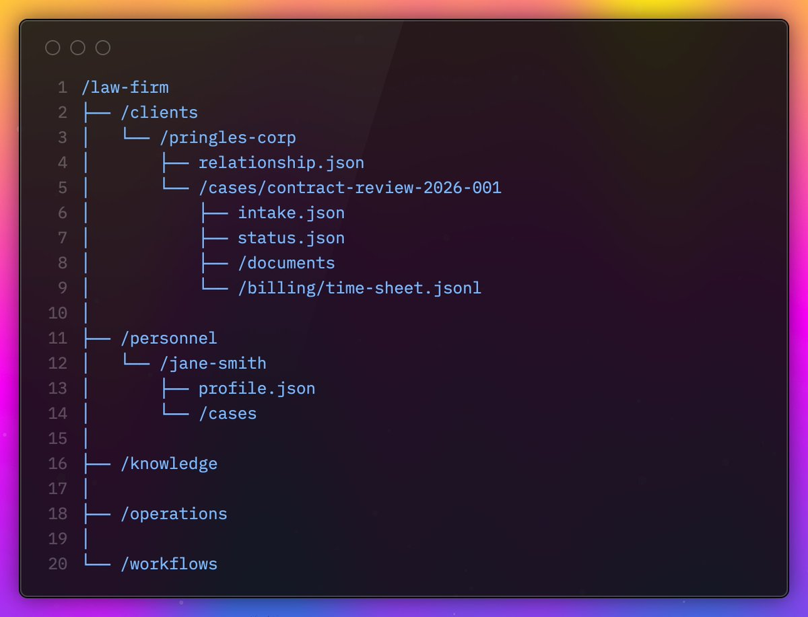

# Your Company should be a Repository for AI agents

The idea of modeling a company as a filesystem for maximum agent efficiency is gaining traction on X (Twitter).

For example, [Eli Mernit](https://x.com/mernit/status/2021324284875153544) wrote that agents get better context if a company is modeled as files ("Your company is a filesystem").

The problem is modeling a company as filesystem doesn't work today because most files are binary formats that agents can't work with effectively. [Anvisha Pai](https://x.com/anvishapai/status/2022062725354967551) pointed that out in her response post "Your company is not a filesystem".

But, what if a system exists that turns binary files into structured data agents can read and write to?


## The case for the filesystem

The "company as a filesystem because of agents" argument is compelling for two reasons:

1. Agents get full context. When company data lives in files, agents can inspect and reason across systems without brittle app integrations.

2. No third party API restrictions. Tools like Codex and Claude Code feel powerful because they can use direct filesystem primitives (`grep`, shell commands, scripts) instead of being constrained by third-party APIs.



## But the filesystem is not enough

A plain filesystem alone doesn't let agents work effectively:

1. Most file formats are not agent-friendly. Documents, spreadsheets, presentations, etc. are binary formats. Agents can parse some formats, but there is no universal semantic layer that enables round-trip editing.

2. Many files cannot be converted into text. A common workaround is to convert binary files to text. But, visual and structural media (for example CAD, PCB, or layered design files) lose critical information when reduced to text. That makes review and verification harder, the real bottleneck with the uprising of AI agents.


## A system that understands binary files

A system that turns binary files into structured data agents can read and write to would enable modeling a company as filesystem.

The implementation can be simple. Parse binary files into their schemas. After all, most binary files are structured data under the hood.

For example, a docx file is a collection of paragraphs, tables, images, etc. All of those can be expressed as JSON that an agent can understand.

```text
  ┌─────────────────┐         ┌───────────────────────┐
  │ contract.docx   │────┬──► │ { type: "paragraph" } │
  └─────────────────┘    ├──► │ { type: "table" }     │
                         └──► │ { type: "image" }     │
  ┌─────────────────┐         ├───────────────────────┤
  │ design.psd      │────┬──► │ { type: "layer" }     │
  └─────────────────┘    └──► │ { type: "mask" }      │
                              ├───────────────────────┤
  ┌─────────────────┐         │                       │
  │ budget.xlsx     │────┬──► │ { type: "row" }       │
  └─────────────────┘    └──► │ { type: "formula" }   │
                              └───────────────────────┘
                                        ▲
                                        │
                                        ▼
                               ┌──────────────┐
                               │    Agent     │
                               │  read/write  │
                               └──────────────┘
```

## Lix is that system

A system that turns binary files into structured JSON agents can understand already exists; it's called **Lix**.

Lix is a "universal" version control system. "Universal" because it can track changes in binary files by parsing files into JSON schemas. Otherwise, tracking changes in those binary files would not be possible. Lix also solves the problem of opaque binary files agents are now running into.

Lix is in alpha, but you can already check out the repository on GitHub.

[Lix on GitHub](https://github.com/opral/lix)


