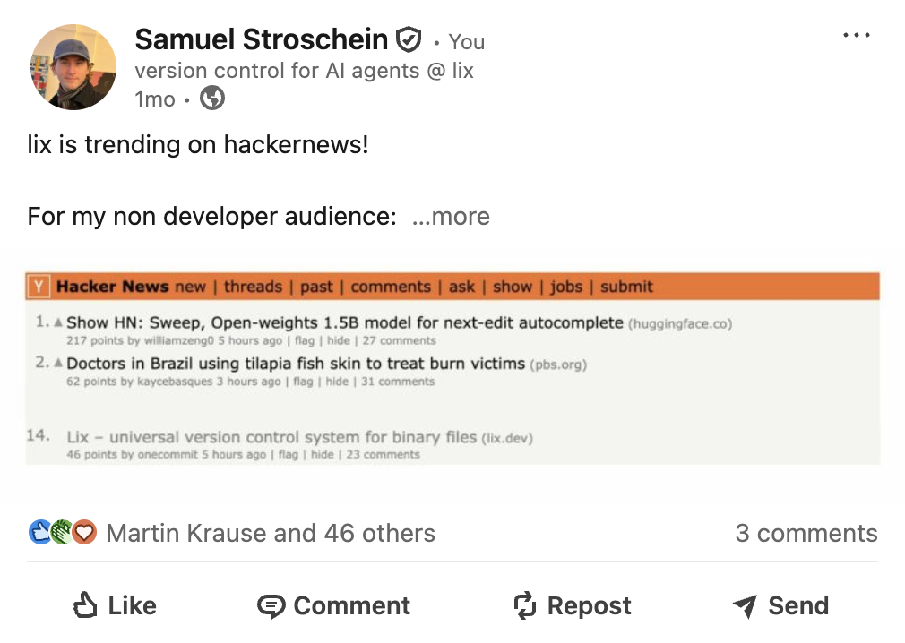
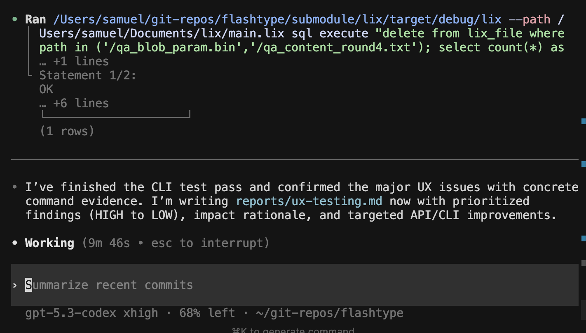

# ---
date: "2026-03-04"
og:description: "The Rust rewrite is complete. 33x faster file writes, lix was trending on HackerNews, and what's next in March."
og:image: "./cover.png"
---

February 2026 Update: Rust Rewrite Complete

**TL;DR**

- 33x faster file writes
- GitHub stars grew from 70 to over 500
- Real workload and AX (user) testing in March
## The Rust rewrite is complete

[RFC 001](https://lix.dev/rfc/001-preprocess-writes) and [RFC 002](https://lix.dev/rfc/002-rewrite-in-rust) have been implemented in February, with two strong outcomes:

### 33x faster file writes

The rewrite significantly improves heavy write paths, with the largest gain on realistic plugin-based JSON file inserts (**33x median, ~40x p95**).

| Benchmark                         | `v0.5`    | `next`    | Speedup    |
|-----------------------------------|-----------|-----------|------------|
| State single-row insert           | 17.43 ms  | 14.85 ms  | 1.17x      |
| State 10-row insert               | 57.33 ms  | 46.53 ms  | 1.23x      |
| State 100-row insert              | 460.27 ms | 193.30 ms | **2.38x**  |
| JSON file insert (120 properties) | 889.81 ms | 26.90 ms  | **33.08x** |

### Controlling the query planner

The new architecture unlocks previously impossible optimizations. The SQL database is merely used as a storage and query execution layer.

v0.5 and below could not optimize beyond what the vtable API of the database provides. Every write triggered per-row callbacks that crossed the JS-WASM boundary with ~10-25 internal SQL queries each. In SQLite's case, even batching mutations was not optimizable.

Lix now intercepts and rewrites queries before they hit SQLite, batching what used to be per-row vtable callbacks into single bulk operations. For more information read [RFC 001](https://lix.dev/rfc/001-preprocess-writes).


```mermaid
         v0.5                           next
        ──────                          ────
       ┌───────┐                     ┌───────┐
       │ Query │                     │ Query │
       └───┬───┘                     └───┬───┘
           │                             │
           ▼                             ▼
    ┌──────────────┐              ┌─────────────┐
    │ SQL Database │              │     Lix     │
    └──────┬───────┘              └──────┬──────┘
           │                             │
           ▼                             ▼
       ┌───────┐                 ┌──────────────┐
       │  Lix  │                 │ SQL Database │
       └───────┘                 └──────────────┘
```

## GitHub stars and HackerNews

Lix was trending on HackerNews in late January. The outcome was an instant jump in GitHub stars and inbound requests to try out lix. Most inbound interest is around AI agents operating on non-code files and formats Git can't handle (Excel, XML, SSIS packages) well.

[https://news.ycombinator.com/item?id=46713387](https://news.ycombinator.com/item?id=46713387)




## What's next in March

People want to test lix. The major use case are AI agents that operate on non-code files (.docx, .pdf, etc.). We have two remaining things to do:

### 1. Real workload testing and bug fixing

Real production workloads will surface performance issues and bugs that should be simple to solve with the completed refactor. After all, we control the query planner now.

### 2. AX (agent experience) testing and API iteration

AX testing? Yes. That's a fundamental shift in 2026. The old way of discussing APIs and/or conducting user interviews are not needed anymore. Ask an agent to do a task, then follow up with "What friction points did you run into?" and fix the friction points.


