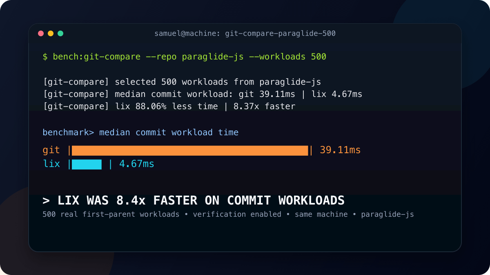

# March 2026 Update: Workload Testing Succeeded, Semantic Layer Too Slow

**TL;DR**

- Real workload testing: without the semantic layer, Lix is ~8x faster than Git on commits
- But the semantic layer is not fast enough yet
- April goal: sub 100ms file writes for files with 10k entities

## Real workload testing revealed that Lix can be 8x faster than Git

[Last month](/blog/february-2026-update) we set out to do real workload testing and bug fixing. The goal was simple: replay actual Git repos in Lix and get peace of mind that Lix is fast enough.

Without the semantic layer, treating files as blobs like Git does, Lix is fast. Surprisingly fast.

The benchmark replays 500 real commits from the [paraglide-js](https://github.com/opral/monorepo/tree/main/inlang/packages/paraglide) repo. For each commit, it sets up the "before" state outside the timer, applies the same file changes, and measures how long Lix takes to commit. The simulated scenario: "I edited some files, now I'm committing."



For reference, Git takes ~39 ms for the same commits. Lix is roughly 8x faster at the blob level.

The difference comes down to architecture. Lix applies mutations inside an open SQLite transaction. Committing is closing that transaction (~1 ms). Git's commit path runs `git add -A` and `git commit` -- scanning the working tree, updating the index, writing tree and commit objects.

| Phase       | Git        | Lix       |
| ----------- | ---------- | --------- |
| File writes | ~0.2 ms    | ~3.6 ms   |
| Commit      | ~39 ms     | ~1 ms     |
| **Total**   | **~39 ms** | **~5 ms** |

## The semantic layer is not fast enough yet

The real workload testing yielded that the semantic layer is not fast enough yet.

> [!NOTE]
> **Refresher: What is the semantic layer?**
>
> Lix's semantic layer parses files into structured entities. Instead of "binary files differ", Lix understands what actually changed inside a file. For example, a `.docx` becomes paragraphs, tables, images.
>
> ```
> Git sees:                     Lix sees:
>
> -Binary files differ          paragraph 3 in `contract.docx` changed:
>                               - "The contract expires on March 1st."
>                               + "The contract expires on April 1st."
> ```

A file insert with N entities is translated to N direct SQL rows. Thus, inserting a file with, for example, 10k entities translates to one file write that triggers at least 10k rows being written to the SQL database. Testing revealed that writing Word documents can quickly turn into 500ms+ operations where >80% of the time is spent writing SQL rows. That is above the 100ms "lag-free" target, and comes with severe storage overhead.

```
  contract.docx
  ┌──────────────────┐
  │ Paragraph 1      │        SQL database
  │ Paragraph 2      │        ┌──────────────────────────┐
  │ Paragraph 3      │───────►│ INSERT row 1 (paragraph) │
  │ Table 1          │        │ INSERT row 2 (paragraph) │
  │   Row 1          │        │ INSERT row 3 (paragraph) │
  │   Row 2          │        │ INSERT row 4 (table)     │
  │   Row 3          │        │ INSERT row 5 (row)       │
  │ Image 1          │        │ INSERT row 6 (row)       │
  │ ...              │        │ INSERT row 7 (row)       │
  │ Paragraph 4,291  │        │ INSERT row 8 (image)     │
  └──────────────────┘        │ ...                      │
                              │ INSERT row 10,000        │
  1 file write                └──────────────────────────┘
                              💥 10,000 row inserts
```

## Making the semantic layer fast

The fix is chunking. Instead of inserting one row per entity, group entities into chunks and store each chunk as a single row. 10,000 entities become ~40 chunk inserts instead of 10,000 row inserts.

```
  Before (naive):                     After (chunked):

  contract.docx                       contract.docx
  ┌──────────────────┐                ┌──────────────────┐
  │ Paragraph 1      │                │ Paragraph 1      │
  │ Paragraph 2      │                │ Paragraph 2      │
  │ Paragraph 3      │                │ Paragraph 3      │
  │ Table 1          │                │ Table 1          │
  │ ...              │                │ ...              │
  │ Paragraph 4,291  │                │ Paragraph 4,291  │
  └──────────────────┘                └──────────────────┘
          │                                   │
          ▼                                   ▼
  ┌──────────────────┐                ┌──────────────────┐
  │ INSERT row 1     │                │ INSERT chunk 1   │
  │ INSERT row 2     │                │  (entities 1-256)│
  │ INSERT row 3     │                │ INSERT chunk 2   │
  │ INSERT row 4     │                │  (entities 257-  │
  │ ...              │                │   512)           │
  │ INSERT row 10,000│                │ ...              │
  └──────────────────┘                │ INSERT chunk ~40 │
                                      └──────────────────┘
  💥 10,000 row inserts                ✅ ~40 row inserts
```

The question is how to chunk. Fixed-size chunks would work for speed, but Lix also needs content deduplication across branches and history. If one paragraph in a Word document is edited, only the chunk containing that paragraph should change. The rest should be shared.

[Prolly trees](https://docs.dolthub.com/architecture/storage-engine/prolly-tree) solve this. Chunk boundaries are determined by content hashes, not fixed positions. That means:

- **Fast writes** -- 10k entities become ~40 chunk inserts
- **Content deduplication** -- identical chunks are stored once, shared across branches and history
- **Fast diffs** -- only walk chunks that differ

```
  contract.docx v1              contract.docx v2
  (original)                    (paragraph 3 edited)
  ┌──────────────────┐          ┌──────────────────┐
  │ Paragraph 1      │          │ Paragraph 1      │
  │ Paragraph 2      │          │ Paragraph 2      │
  │ Paragraph 3      │          │ Paragraph 3 ✎    │
  │ Table 1          │          │ Table 1          │
  │ ...              │          │ ...              │
  │ Paragraph 4,291  │          │ Paragraph 4,291  │
  └──────────────────┘          └──────────────────┘
          │                             │
          ▼                             ▼
  ┌──────────────┐              ┌──────────────┐
  │   chunk A  ──┼──────────────┼── chunk A    │  ← same, stored once
  │   chunk B    │              │   chunk B'   │  ← different (contains edited paragraph 3)
  │   chunk C  ──┼──────────────┼── chunk C    │  ← same, stored once
  │   chunk D  ──┼──────────────┼── chunk D    │  ← same, stored once
  └──────────────┘              └──────────────┘
```

Only `chunk B'` differs (it contains paragraph 3). Chunks A, C, and D are identical across versions and stored once. Creating a branch or a new version just points to the same chunks.

### Why not skip the semantic layer entirely?

If Lix is already fast without the semantic layer, why not just store blob diffs like Git and diff on the fly?

The semantic layer is Lix's core differentiator. It's what enables fast diffs, queryable history, and real-time merges for any file format. Without it, editing large files means serializing the entire file and writing it back. An agent updating one paragraph in a `.docx` shouldn't need to rewrite a 300 KB blob. We want direct entity updates -- write to paragraph 3 directly.

But doing on-the-fly diffing _and_ direct entity writes creates two sources of truth:

```
  Option A: Blob is source of truth (like Git)

  ┌──────────────┐       ┌──────────────┐
  │ contract.docx│       │  on-the-fly  │
  │   (blob)     │──────►│   parser     │──────► entities
  └──────────────┘       └──────────────┘
        ▲
        │ write entire file
        │ to change anything
```

Every edit requires serializing the full file. Every diff, merge, and conflict check re-parses the blob.

```
  Option B: Entities are source of truth (Lix)

  ┌──────────────┐       ┌──────────────┐
  │   entities   │       │  serialize   │
  │  (writable)  │──────►│   to blob    │──────► contract.docx
  └──────────────┘       └──────────────┘
        ▲
        │ write to paragraph 3
        │ directly
```

Edits are direct. The blob is a derived artifact. Diffs, merges, and branches operate on entities.

Option A doesn't work for Lix's use cases. Option B requires the semantic layer to be fast.

## What's next in April

**Semantic layer: sub 100 ms for 10k entities.** With Prolly tree chunking, a file with 10,000 entities (a large JSON or a real-world `.docx`) must insert in under 100 ms.

Anything below 100 ms is not perceived as lag. 10,000 entities is the upper end of real-world Word documents we're testing against. This means deviating from the SQL database's standard B-tree storage and managing our own tree structure on top. Whether the tradeoff pays off in practice is what April will tell.
