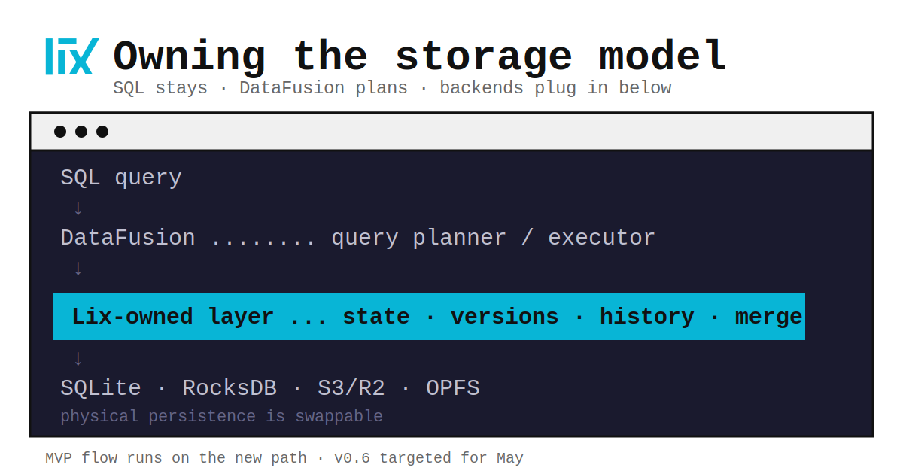

# April 2026 Update: Adopting DataFusion



**TL;DR**

- Benchmarking exposed that SQLite gives too little control over Lix's versioned storage model to keep improving incrementally.
- Decision: move query execution to DataFusion while keeping SQLite as a possible physical storage implementation.
- May goal: Release `v0.6` MVP with focus on CRUD with branching and merging on the optimized semantic write path that the file API will use next.

## What works now

The important April result is that the core API works on the new path.

The shape is the MVP API:

```ts
import { openLix, SQLite } from "@lix-js/sdk";

const lix = await openLix({
  storage: new SQLite({ path: "app.lix" }),
  // Later: swap this for a RocksDB/S3/OPFS storage
  // without changing the Lix API below.
});

await lix.createVersion({ name: "draft" });

await lix.execute("INSERT INTO markdown_paragraph (id, text) VALUES ($1, $2)", [
  "paragraph_1",
  "Ship CRUD MVP",
]);

await lix.switchVersion({ name: "main" });

await lix.mergeVersion({ source: "draft" });
```

The exact API names might still change. The important part is that the flow works:

- open a Lix
- create a version
- write entities with CRUD operations
- switch versions
- merge a version

That is the product surface for the MVP.

Files are not in the `v0.6` MVP on purpose.

A file write fans out into entity writes. A Word document, JSON file, or spreadsheet save can become thousands of inserts. That means the file API can only be as fast as the entity layer underneath it. The 10k inserts benchmark measures that layer.

Most apps and agents should write entities directly anyway. They should update a paragraph, cell, or property, not re-serialize a whole document. The file API comes after CRUD because it is built on the same semantic write path.

The first preview is published on npm:

```bash
npm install @lix-js/sdk@0.6.0-preview.2
```

[`@lix-js/sdk@0.6.0-preview.2`](https://www.npmjs.com/package/@lix-js/sdk/v/0.6.0-preview.2) is not the final `v0.6` MVP yet. It is the preview that proves the new path can be installed and tested.

## April goal

[Last month](/blog/march-2026-update) we found the next bottleneck: semantic writes.

The blob path was already fast. The semantic path was not. Writing one file can fan out into thousands of entities, and the April goal was to get **10k entity inserts under 100ms**.

The number is not random. A semantic file is not one row:

- a Word document becomes paragraphs, tables, comments, images, and relationships
- a JSON file becomes hundreds or thousands of properties
- a spreadsheet becomes cells, formulas, sheets, and metadata

10k inserts is the first useful proxy for "real file, real structure." 100ms is the interaction budget. Below that, the write still feels instant. Above that, Lix becomes something users and agents wait on.

We did not hit the benchmark in April.

We are not publishing a final April number because the benchmark target moved to the new DataFusion path. Optimizing the old SQLite-centered path further would measure the architecture we are replacing.

The problem was not one slow query. The SQLite-centered path kept pushing Lix concepts like version roots, inherited rows, tombstones, and file projections into SQLite tables and views. Each optimization fixed one path, but the next feature needed another translation layer.

## Finding: too little control

The recurring problem has been architecture confidence. Lix should ship an MVP and improve from there. But that only works if the architecture can be improved incrementally.

In February, we wrote that the Rust rewrite gave Lix control over the query planner. That wording was too broad. Lix controlled the query before SQLite saw it. Lix could parse and rewrite SQL, batch operations, and avoid many vtable callbacks.

April showed that this is not enough.

SQLite still owns the final query planner and storage model. Lix can rewrite queries before SQLite sees them, but the result still has to fit into SQLite tables, indexes, views, and vtables.

The 10k inserts work made the missing control clear. Lix needs control from the incoming query all the way down to raw storage. Every write touches current state, history, branch visibility, file projections, and later merge inputs. Those choices depend on the physical shape of the data.

```plain
  February / March architecture

  ┌───────────┐
  │ SQL query │
  └─────┬─────┘
        │
        ▼
  ┌────────────────────────┐
  │ Lix SQL parser/rewrite │  ← Lix controls this
  └─────┬──────────────────┘
        │
        ▼
  ┌──────────────────────┐
  │ SQLite query planner │  ← SQLite still controls this
  └─────┬────────────────┘
        │
        ▼
  ┌───────────────────────────────┐
  │ SQLite tables/views/vtables   │  ← Lix concepts squeezed here
  └─────┬─────────────────────────┘
        │
        ▼
  ┌────────────────┐
  │ SQLite storage │
  └────────────────┘
```

## Decision: adopt DataFusion

DataFusion is an Apache Arrow SQL query engine. It gives Lix SQL parsing, planning, and execution while letting Lix provide the logic underneath.

The decision is not "SQLite bad, custom database good." Reusing a query engine is still the right idea. The mistake would be building one from scratch when DataFusion exists.

That is the control Lix needs: from incoming query, through `lix_state`, versions, history, branch visibility, merge inputs, and file projections, down to the raw storage layer.

SQLite does not go away. It can still provide physical storage. The change is that SQLite no longer defines the query and storage shape of Lix state.

```plain
  DataFusion-centered architecture

  ┌───────────┐
  │ SQL query │
  └─────┬─────┘
        │
        ▼
  ┌─────────────────────────┐
  │ DataFusion query engine │  ← Lix controls query execution
  └─────┬───────────────────┘
        │
        ▼
  ┌──────────────────────────────────┐
  │ Lix logic + storage abstraction  │  ← Lix controls this
  └─────┬────────────────────────────┘
        │
        ▼
  ┌──────────────────────────────────┐
  │ SQLite · RocksDB · S3/R2 · OPFS  │  ← physical storage
  └──────────────────────────────────┘
```

Lix does not need to invent physical storage. Existing systems should still handle durability, transactions, files, pages, object storage, and the other hard parts of persistence. The prolly-tree direction from March is now part of this storage abstraction work: make branching cheap by sharing unchanged state, while keeping CRUD operations fast enough for the MVP.

This also changes the portability story. Earlier posts framed portability as "any SQL database." With DataFusion, portability moves one layer down: any storage that can satisfy Lix's storage abstraction. Postgres can still be a storage later, but not because Lix delegates SQL execution to Postgres.

## What happened to March's goals

March had three April goals:

1. 10k entity inserts under 100ms
2. prolly trees for cheap branching
3. workload testing with the semantic layer on

The first goal moved to May on the DataFusion path. Prolly trees moved into the broader physical storage abstraction work. The semantic workload replay should happen after the `v0.6` path is fast enough to be the path we intend to ship.

## What's next in May

May goal: turn the preview into the Lix `v0.6` MVP.

The acceptance criteria:

1. CRUD operations work through the new DataFusion path.
2. Branching and merging work on that path.
3. 10k semantic inserts are under 100ms.
4. The Lix physical storage abstraction is no more than 1.5x slower than a direct SQLite storage + query baseline for the same workload.

The 1.5x number is the guardrail for the storage abstraction. It is not the final product latency target. It checks that the abstraction itself is not the bottleneck. If storage is close to SQLite's baseline, Lix can ship the MVP and keep optimizing query/runtime logic above it incrementally.

Files follow after CRUD because file writes fan out into the same entity writes.

Everything else is secondary.
