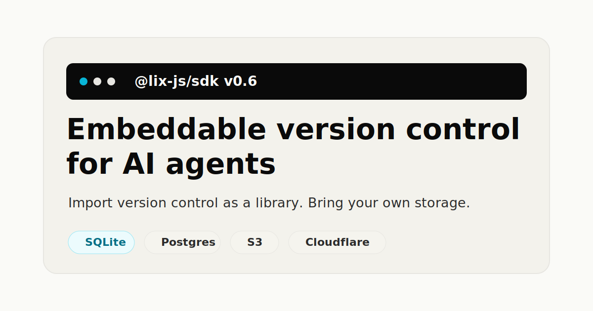

# Lix v0.6 Release: Ready to Embed



**TL;DR**

- `@lix-js/sdk` v0.6 is the first usable release of the embeddable SDK.
- Apps open Lix in-process, pass a backend, and version app state without a Git sidecar.
- What ships today: in-memory storage, SQLite persistence, branches, transactions, file bytes, merge preview, merge, and SQL-queryable history.

## What shipped

```bash
npm install @lix-js/sdk
```

The product surface is small on purpose:

```ts
import { openLix, SqliteBackend } from "@lix-js/sdk";

const lix = await openLix({
  backend: new SqliteBackend({ path: "app.lix" }),
});

await lix.fs.writeFile("/hello.md", new TextEncoder().encode("Hello World"));

const draft = await lix.createBranch({ name: "draft-v2" });
await lix.switchBranch({ branchId: draft.id });
```

No repository checkout. No Git subprocess. No separate object store for blobs.

Your app owns the process and storage. Lix provides the versioning layer: branches, file bytes, history, transactions, merge, and SQL queries.

## Why not wrap Git?

Agents need version control primitives inside the systems they modify: isolated branches, reviewable changes, transaction rollback, and durable state.

Today, the default answer is to wrap Git.

That works for code repositories. It gets awkward when every agent run needs app-level state, blobs, history, and a transaction boundary. You inherit:

- working trees per worker
- process calls
- LFS for blobs
- transaction coordination with the rest of your data

Lix moves those primitives into the application process. Commits go through the backend instead of a separate Git repository.

## Ready to embed

The important change since the [April update](/blog/april-2026-update): the backend boundary is explicit enough to build against.

```plain
  App / agent
      │
      ▼
  Lix SDK
      │
      ├── branches
      ├── files and blobs
      ├── history
      ├── transaction rollback
      └── SQL queries
      │
      ▼
  Backend
      │
      ├── in-memory
      ├── SQLite
      └── custom synchronous backend
```

In-memory and SQLite ship today. Anything else implements the backend interface. Postgres, S3/R2, IndexedDB, and Cloudflare-style storage are the direction, not built-in adapters in this release.

SQLite is the local default, but not the product boundary. The product boundary is the backend interface: Lix owns the version-control model, the backend owns persistence.

## What Lix gives agents

- **Branches** for isolated agent work without Git worktrees.
- **Transaction rollback** when a write should not commit.
- **File bytes** stored with the same history as the state around them.
- **Merge preview and merge** for draft branches.
- **SQL history** so agents can query what changed.

The SQL part matters. If the question is "which files did this branch touch?", the answer should be a query over history, not a reread of the workspace.

That keeps agent context grounded in the actual version history.

## What v0.6 is ready to prototype

- **Agent workspaces without Git worktrees.** Give each agent a branch, let it edit state, then inspect and merge the result from inside your app.
- **Review flows for AI changes.** Query what changed and show humans a review screen before merging.
- **Versioned app state.** Add branches, history, transaction rollback, and merge to an editor, CMS, internal tool, or AI product.
- **Local-first versioned storage.** Start with SQLite for a local agent runtime while keeping the Lix API separate from the physical backend.
- **Custom backend experiments.** Put the same versioning model on another synchronous transactional store by implementing the backend interface.
