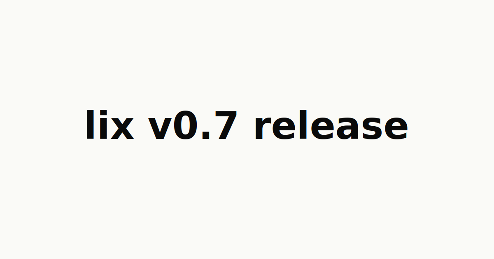

# Lix v0.7 Release: Plugin API and a Rebuilt Storage Engine



**TL;DR**

- The file plugin API is stable. CSV, Markdown, and plain text plugins ship in v0.7. A CSV cell edit is a row-level change you can query, diff, and merge.
- The storage engine was rebuilt across twelve PRs. A 10k-row merge through the full plugin pipeline runs 1.8x faster, point reads 2.2x faster, and a commit writes 47% fewer bytes.
- The filesystem storage can mirror a lix into a plain directory and back.

## Plugin API is stable

v0.7 stabilizes the file plugin API.

Plugins teach Lix how a file format maps to semantic entities and changes: rows, cells, paragraphs, text ranges, or any schema a format needs.

At a high level, a plugin turns file bytes into entities that Lix can version:

```txt
file bytes        plugin        lix entities        lix changes
----------        ------        ------------        -----------
orders.csv   ->   CSV      ->   rows + cells   ->   price: 12 -> 14
notes.md     ->   Markdown ->   headings       ->   heading moved
```

The plugin defines what entities exist in a file and how to detect changes between two versions of that file. Lix stores the resulting changes, which makes diffing, merging, querying, and rollback work at the level of the file format instead of at the level of raw bytes.

For example, a product catalog changes:

```text
Before:
| id   | product  | price |
| ---- | -------- | ----- |
| 4812 | Notebook | 12    |

After:
| id   | product  | price |
| ---- | -------- | ----- |
| 4812 | Notebook | 14    |
```

A line-based diff can only tell you that the CSV row changed:

```diff
-4812,Notebook,12
+4812,Notebook,14
```

Lix can expose the cell that changed:

```diff
row 4812 price:

- 12
+ 14
```

Move that row somewhere else in the file, and Lix records a row move instead of a delete plus insert.

CSV, Markdown, and plain-text plugins ship with v0.7. Files without a plugin still use the blob path: content-defined chunked blobs, deduplicated across versions.

This is the difference between "the file changed" and "row 4812's price column changed". Diffs become semantic, merges become row-granular, and agents can query exactly what they touched.

## 1.8x faster engine

Plugins multiply the load on the storage engine. A 10k-row CSV is 10k tracked entities, each with its own history. v0.7 spent twelve PRs rebuilding the physical layout, each one measured against the last:

| Benchmark                              | start of the rebuild | v0.7     |
| -------------------------------------- | -------------------- | -------- |
| merge_10k, e2e CSV plugin pipeline     | 347.8 ms             | 190.0 ms |
| read_one_by_pk, engine                 | 213.1 us             | 96.2 us  |
| bytes written per 1k-row insert commit | 827.5 KB             | 436.5 KB |
| storage puts per 1k-row insert commit  | 2,031                | 1,074    |
| space truncate, 20k rows               | 10.7 ms              | ~0.6 ms  |

The design that came out of it:

- Every payload is stored exactly once. A row's current-state entry references the change that produced it; the change record owns the content. The previous design stored payloads in a separate content-addressed store with refs from two places.
- The storage interface is space-aware. Each engine keyspace maps to its own SQLite table instead of one interleaved tree behind prefixed keys. Point reads descend small per-space B-trees. Dropping a space truncates a table.
- Keys and values got smaller: binary UUIDs instead of text, front-coded keys inside chunks, change and commit ids deduplicated into chunk-local dictionaries, and compression only where measurement showed the payload population benefits.

The final design also has fewer concepts than v0.6: one payload location instead of three, no compression on the hot read path, and read latency at parity while writing 47% fewer storage rows per commit.

Every step is recorded in the engine's optimization log, including two designs that were built, measured, and discarded along the way, with the benchmark methodology to reproduce the numbers.

## Filesystem storage

Lix can now use a plain directory as a filesystem storage:

```ts
import { LocalFilesystem, openLix } from "@lix-js/sdk";

const lix = await openLix({
  storage: new LocalFilesystem({
    path: "./workspace",
    syncAllFiles: true,
  }),
});
```

Edit files in the directory with any tool and the changes flow into Lix with full history. Switch branches and the directory follows.

## Also in v0.7

- `INSERT ... ON CONFLICT` upserts for entity state.
- Stable file plugin API for mapping file formats to semantic entities and changes.
- e2e benchmarks in the repository, the same ones the table above comes from.
