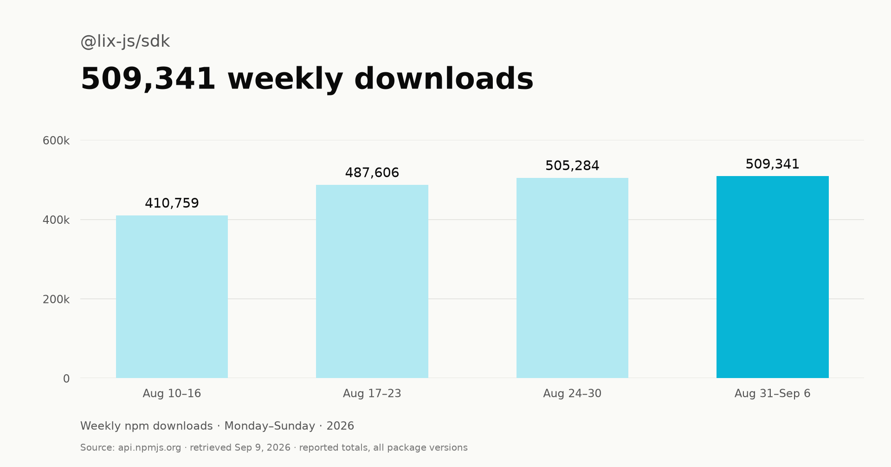

# lix v0.16: Over 500k weekly downloads

Lix crossed **500k weekly downloads on npm**. The `@lix-js/sdk` package recorded **509,341 downloads from August 31 to September 6, 2026**, according to the [npm downloads API](https://api.npmjs.org/downloads/point/2026-08-31:2026-09-06/@lix-js/sdk).

*Source: [npm download counts](https://api.npmjs.org/downloads/range/2026-01-01:2026-09-06/@lix-js/sdk), retrieved September 9, 2026. Downloads include repeated installs and CI runs; they are not unique users or installs of v0.16 alone.*

This is a major milestone. From inlang, we also know Lix is deployed to **over 100,000 users**.

Inlang is our proof point. We ran an A/B comparison against the previous inlang version, which used SQLite-WASM. With Lix, inlang maintains application performance while adding version control to its data.

## What changed since v0.7

Since our last release post, Lix has added:

- **Local-first sync and hosting.** A deployable reference server, local reads and writes with background uploads, offline reopening, and history fetched on demand. Custom and plugin-defined rows sync with their schemas and typed values.
- **More control over history.** Persistent undo and redo, account attribution, full repository snapshots, and SQL functions for logs, history, and point-in-time reads.
- **Typed SQL.** PostgreSQL syntax, native column types, `$1` parameters, and `RETURNING` for writes, with faster queries and CRUD operations.
- **More capable file plugins.** Structural JSON edits and improvements to CSV, Markdown, and Excalidraw that preserve file content and formatting when editing rows.
- **Faster repository operations.** Less copying and scanning during branches, checkpoints, merges, and history queries, plus more efficient binary storage.

v0.16 includes breaking repository and sync changes. Upgrade clients and servers together. `lix_as_of` replaces `lix_state_at`, and checkpoint membership now lives on `lix_commit.is_checkpoint`. See the [changelog](https://github.com/opral/lix/blob/main/CHANGELOG.md) for migration details and the full release history.

With production performance established in inlang, we also wanted to see how Lix compares against Git for repository operations.

## Repository performance against Git

We benchmarked Lix against Git using file sets from VS Code Docs, inlang, and Paraglide. The suite covers initial setup, changed-file detection, branching, writes, and disjoint merges.

Here are the VS Code Docs results. Times are medians in milliseconds; lower is better.

| Operation | Git | Lix |
|---|---:|---:|
| Initial setup | 97.32 | 170.52 |
| Changed-file detection | 8.41 | 0.41 |
| Create branch + switch there and back | 19.24 | 2.86 |
| Write + commit workflow | 18.44 | 7.88 |
| Disjoint merge | 17.97 | 0.59 |

On this fixture, Lix takes longer to initialize, then completes the measured ongoing operations faster. Across all three fixtures, Lix wins changed-file detection, write/commit, and disjoint merge. Git wins initial setup on VS Code Docs and branching on inlang.

This compares Git’s CLI and worktree with embedded Lix using RocksDB, without a separate checkout. The tests use raw files with semantic plugins disabled.

## Bonus: comparison with SQLite

Lix stores data as normal rows, including files. Plugins can map file contents to structured rows, and applications can store structured data directly. These rows can be queried and updated through SQL, with version control.

That makes Lix useful beyond storing files in a company repository. The same repository can hold application records, such as inlang’s translation bundles and variants, alongside files. Applications can query and edit those records without parsing and rewriting whole files.

This is why we also compare Lix with SQLite. We measured inlang’s queries with Lix change tracking enabled and disabled against the previous SQLite-WASM build. Untracked rows do not record version history. Times are medians:

| Operation | Lix, tracked | Lix, untracked | SQLite-WASM |
|---|---:|---:|---:|
| Read 500 nested bundles | 8.10 ms | 7.58 ms | 27.62 ms |
| Read one bundle | 0.49 ms | 0.31 ms | 0.12 ms |
| Update one variant | 0.48 ms | 0.16 ms | 0.02 ms |
| Atomic nested insert | 0.86 ms | 0.29 ms | 0.20 ms |

SQLite is faster for point operations. Tracked Lix is about 3.4× faster on the nested 500-bundle read in this setup.

This compares native Lix with SQLite-WASM, so it measures those specific implementations and query paths. It does not establish that Lix is generally faster than SQLite.
