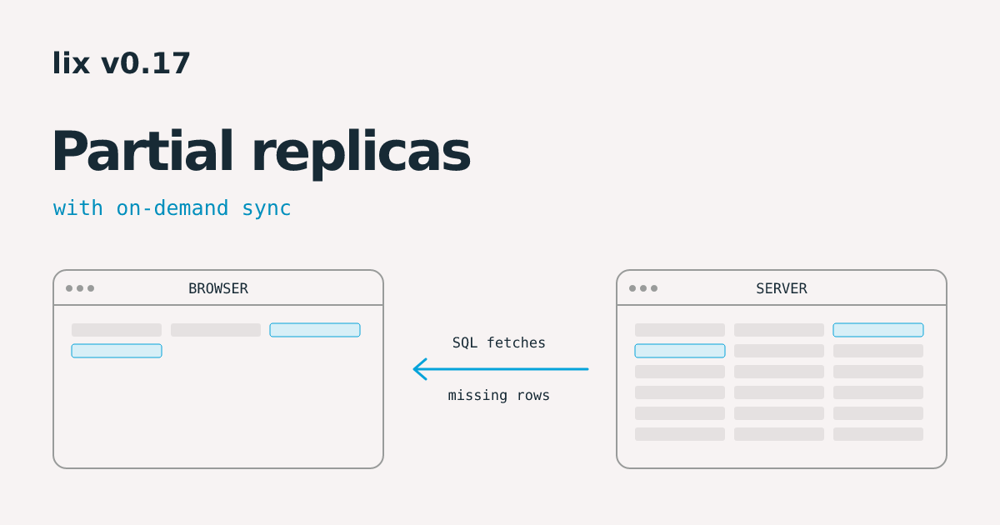
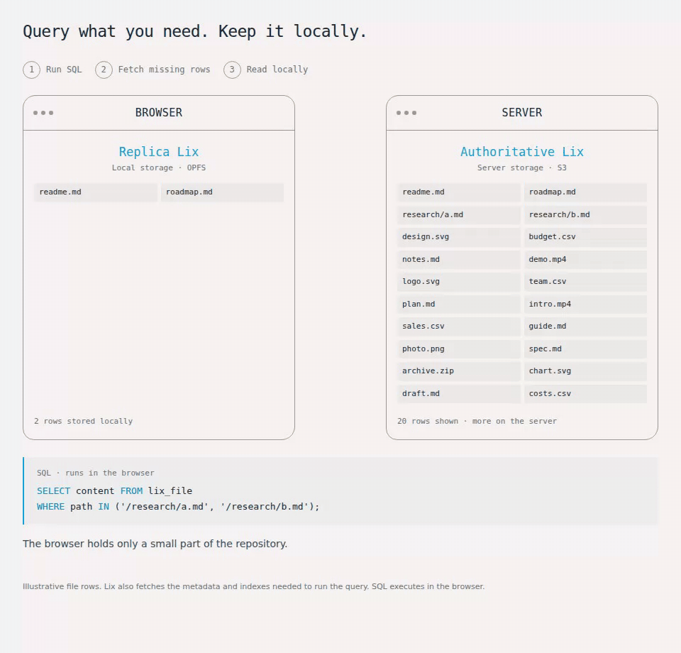

# lix v0.17: Partial replicas with on-demand sync



We're releasing **Lix v0.17 with partial replicas**. Open a repository without downloading it in full. Lix fetches data when you query it, keeps it locally, and syncs changes in the background.

## Use case: removing network roundtrips in web apps

With partial replicas, your app reads and writes locally once the data it needs is loaded. Changes sync in the background. SQL queries fetch missing data on demand.

[LixRay](https://lixray.com) is an example you can try. It runs a company repository in your browser, with a partial replica stored in OPFS. Once a document's required data is local, reading and editing it does not need a network roundtrip.

## How it works

Here is a real-world example: how [LixRay](https://lixray.com) uses partial replicas to run a company repository in the browser.


The browser runs Lix locally and stores data in **OPFS**, the browser's private file system. The server stores repository data in **S3** through SlateDB.

When you open a report, Lix fetches the missing data and saves it in OPFS. Later reads use the local copy. Edits are saved locally and sync to the server in the background.



You can work offline when the data needed for a read or edit is already local. If something is missing, Lix needs a connection to fetch it.

## Fewer requests for history

Partial replicas load history with fewer network roundtrips by grouping independent requests and fetching earlier commit metadata more efficiently.

The release also narrows file-ID lookups to the files and parent directories needed, keeps sync watches active during reads, and fixes transaction and filesystem reconciliation issues.

## Try it

Connect a browser replica to an existing hosted repository:

```ts
import { openLix } from "@lix-js/sdk";
import { OpfsStorage } from "@lix-js/storage-opfs";

const lix = await openLix({
  storage: new OpfsStorage({ name: "company-repository" }),
  server: { url: repositoryUrl, mode: "partial_replica" },
});

await lix.execute(
  "SELECT content FROM lix_file WHERE path = $1",
  ["/research/report.md"],
);
```

Use the host's `/lix/{uuid}` connection URL and authentication headers where required. Running a query ahead of an interaction also prefetches its data.

Upgrade clients and servers together. See the [changelog](https://github.com/opral/lix/blob/main/CHANGELOG.md) and [replica migration guide](https://github.com/opral/lix/blob/main/docs/partial-replica-migration.md) for the full v0.17 changes and upgrade instructions.
