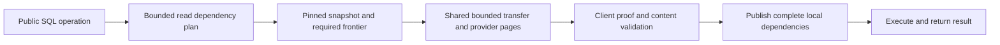

# Bounded dependency discovery and transfer

A public operation should discover its known dependencies before transfer, fetch independent groups together, and validate the result against its pinned repository snapshot. The optimization target is time along the critical path under latency, bounded memory, and correct publication. A request count alone does not measure latency: parallel requests can finish before a smaller serial chain.

The partial replica uses operation-specific dependency recipes and shared transport, storage admission, and executable preparation. The shared layer owns cardinality and byte limits, ordered missing slots, verified immutable content, cancellation, and cleanup. Domain code identifies dependencies; it does not implement a new unbounded transfer loop. Immutable cache entries must match their content identity, and in-flight work must be scoped to the relevant authority/snapshot rather than conflating unrelated operations.

Exact file-content queries use the same scan-request and projection recipe builder in initial read planning and provider execution. This lets a parameterized identity query request paths and required content together. The planner accepts only shapes whose dependencies it can determine exactly; it keeps ordering, joins, offsets, unsupported predicates, and computed-content projections on their existing validated routes. A substring or content-length projection must not cause whole-file hydration merely because its expression mentions content.

The worker scheduler lets a held network operation yield so an independent resident read can finish. It preserves ordered writes, operation cancellation and generation fences. One held child request must not stall every session belonging to a repository.

Observer registration uses the same scheduler queue with a separate bounded waiting budget: 32 live registrations and 32 waiting registrations globally, with at most 32 waiters per client scope/session. Waiting observers do not consume the ordinary 128 global or 32 per-session queue budget. A registration acquires its live permit only when it starts. Iterator cancellation removes obsolete queued setup, closes late registrations, and follows the current observer handle after owner recovery; session teardown aborts and drains setup before releasing resources.

[Browser observer admission results](performance/partial-replica-observer-admission-2026-10-08.json) show the release blocker: temporary view overlap reached 32 adopted observers across two clients, with slots freeing approximately 10–100 ms later. Immediate admission produced four capacity rejections. The bounded waiting prototype passed the same bidirectional editing, exact convergence, and fresh OPFS reopen scenario while keeping the observed active peak at 32. Exact test durations were 63.4 versus 63.1 seconds; post-edit convergence was 4972 versus 4979 ms. This single diagnostic pair supports the correctness fix without establishing a general latency improvement. QA counters are excluded from production; their capture before context cleanup does not prove complete resource drain.

## Measurement method

Use the real browser worker and OPFS storage, HTTP proxy, and native SlateDB authority. Record cold opening, the first selected operation, resident repetitions, peer visibility, and reopen separately. Check exact bytes locally, at a peer, and at the authority; close the old page and verify a distinct new page can reopen the data. Simulated latency should test dependency waves and elapsed time, not impose arbitrary total request budgets. Keep the SDK/WASM, provider, server, corpus, and CPU allocation identical between paired arms except for the proposed change.

See [isolated SQL results](performance/partial-replica-sql-point-2026-10-08.json). Fourteen matched cases verified content and reopen equality. Cold file selection changed from two sequential fulfillment transfers to one. Diagnostic median times at 0/100/500 ms injected latency were 678/798/1597 ms before and 518/634/1047 ms after. Resident repetitions were approximately 13–15 ms. Concurrent host builds were active: these times identify the removed waterfall, but do not qualify global performance or startup regressions. The earlier 100 ms arm had worse startup. A separate quieter repeat is described below; the shared host is not an exclusive performance lab.

Industry references support the same separation. [FoundationDB](https://apple.github.io/foundationdb/performance.html) recommends starting independent reads before awaiting results while preserving transaction ordering. [SQLite WAL](https://www.sqlite.org/wal.html) documents that the default automatic checkpoint runs on the committing thread, so checkpoint scheduling must be measured separately from durable commit. Moving checkpoint work cannot justify weakening durability or ignoring its eventual cost.

A sub-100 ms resident interaction is a different workload from a cold remote miss. A cold operation cannot complete faster than a necessary remote round trip; minimizing dependency waves and preparing likely bounded dependencies is essential. Report local durable acknowledgement, remote publication, and peer visibility separately, including cold plugin compilation and storage work.

## Provider pages and catalog preparation

The required-chunk server path groups contiguous chunk dependencies through the same verified, byte-bounded reader used for a single chunk. A page admits at most 32 requested slots, at most 8 MiB of aggregate encoded values, and at most the raw chunk codec's 4 MiB plus header allowance for one value. Provider limits apply before values are allocated. The reader preserves missing slots and validates an entire page before visiting its borrowed payloads. The private response spool still fails without sealing a response when a required chunk is missing or corrupt.

[SlateDB adapter results](performance/partial-replica-chunk-pages-2026-10-08.json) compare singleton reads with pages, with identical bounded APIs and complete ordered-value verification. At 100 ms synthetic ObjectStore GET latency, six 1 MiB values took 2857 ms through singleton reads and 509 ms through a page; sixteen values took 8137 versus 614 ms. Zero-latency cases were 39 versus 7 ms and 107 versus 10 ms. These measure actual adapter scheduling against an in-memory ObjectStore with synthetic delay, not native S3 deployment or browser latency. Six engine Memory tests cover page ordering/delay, missing slots, encoded limits, corruption, and a missing required chunk at the authority endpoint. The native build and real OPFS cold/resident/reopen fixture also passed.

Catalog preparation receives the whole bounded returned-row union once per operation. Previously FileContent and FilesystemMetadata interests prepared their catalogs separately, followed by another captured-row preparation. The deduplicated union retains all selected/global branch guards, uses the same pinned reader, and validates schemas before executable closure. Memory endpoint coverage includes duplicate file interests and a returned global account row; catalog-reader coverage verifies six identity scans for two unique branches and malformed-schema rejection. Timing gains from this small catalog change are not yet independently qualified.

Three quieter interleaved pairs at 100 ms, with the same native server and OPFS provider for both client arms, reproduced the reduced dependency wave. Median cold SQL was 1006 versus 857 ms; startup was 857 versus 795 ms; resident SQL was 12.4 versus 13 ms; reopen plus read was 118 versus 124 ms. Exact file bytes and reopen checks passed in all six cases. The earlier startup regression did not reproduce, while the small reopen difference needs continued monitoring. See the [repeat results](performance/partial-replica-sql-point-quiet-2026-10-08.json).

## Warm collaboration acceptance

The primary performance target is a small edit in Client A becoming visible in independent Client B in under 100 ms when both clients and the authority are initialized. Resident SQL timing is not a substitute for that measurement. The warm collaboration measurement includes transferring and validating the new dependencies created by the edit; an unseen new commit or blob does not turn that interaction into an initialization benchmark. Report cold browser and SlateDB initialization separately; initialization above 100 ms is acceptable for this target. Record local durable acknowledgement, upload dispatch, authority publication, peer dependency application, and peer DOM visibility on the same timeline. Synthetic transport delay is a separate resilience/scheduling experiment; zero injected delay is the local end-to-end latency comparison.

The initial 20-edit warm profile converged exactly and passed fresh OPFS reopen, but median peer visibility was approximately 876 ms. Notification arrived promptly after server publication; local upload preparation, per-input residency reads during closure installation, and later content hydration account for candidate bottlenecks under investigation. See LixRay issue 594. No sub-100 ms collaboration result has been achieved yet.

A shared nonblocking 4 MiB retained-payload permit now avoids private durable staging for small validated read closures. The bound applies across a native process or one WASM instance, not to total RSS: a bounded decoded transport page and codec/promotion copies can coexist. Terminal request, digest and membership validation precedes publication. Overflow, framed records or unavailable capacity use the owner-fenced durable staging path; spill retains the permit until definite acknowledgement. Thirty Memory tests include corruption, cancellation, lost acknowledgements, oversized/framed inputs and cleanup. Twelve matched cold/resident/reopen cases and eighty actual editor updates passed exact data and reopen validation. Diagnostic median warm peer visibility improved from 969 to 840 ms, with substantial remaining work; this does not meet the 100 ms collaboration target. Both warm arms used the same experimental OPFS checkpoint provider, which is excluded from this change. These measurements isolate retained closure handling within that setup, not the final production provider's absolute performance. The candidate had slower startup in all three cold arms, most pronounced at 100 ms, and a higher worst warm sample; no universal latency or tail improvement is claimed. See [retained-closure results](performance/partial-replica-retained-closure-2026-10-08.json).
