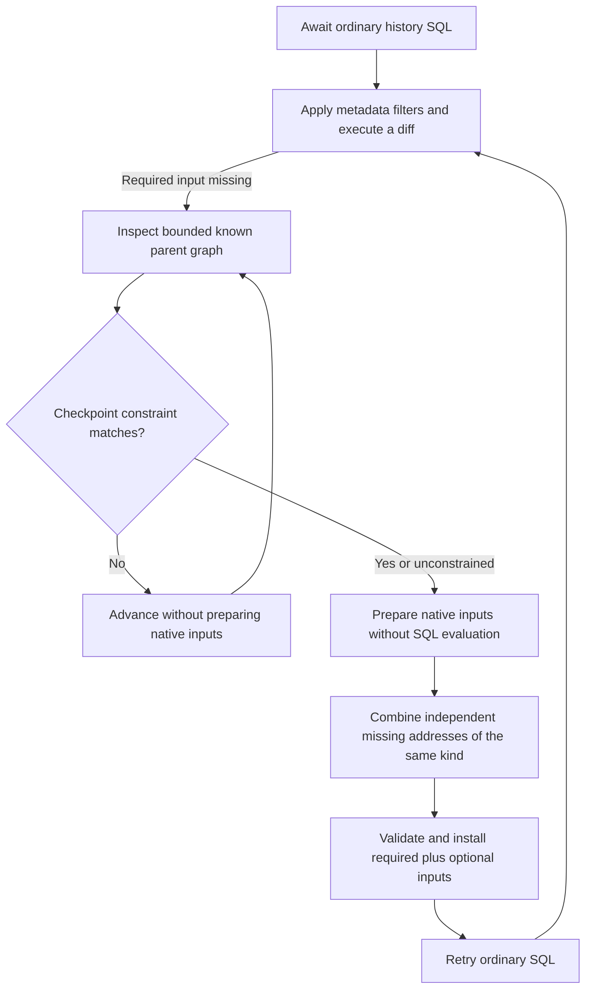

# E11: selection-aware history dependency discovery

**Accepted for substantial cold-history gains, with a measured first-warm-query tradeoff.** E10's lookahead prepared native inputs
for commits excluded by the SQL checkpoint filter. E11 carries a proven checkpoint
constraint into discovery and skips those preparations. It preserves ordinary
awaited SQL and leaves required dependency resolution unchanged.

## Measured motivation

A diagnostic E10 build logged the elapsed native preparation time and frontier
size before and after each probe. The wide fixture produced 326 probes; only seven
added dependencies. Unproductive probes consumed 537,046 microseconds of the
539,061 total. Dense64 produced 202 probes, 146 productive, with 68,449 microseconds
total and 40,798 unproductive. These instrumented runs explain where work occurs;
they are not acceptance timing samples.

The wide fixture inserts 16,000 unrelated files in batches before creating four
checkpoints. The history query selects `lixcol_commit_is_checkpoint=true`.
Ordinary history applies that filter before preparing a diff; E10 lookahead did
not carry the filter and could prepare excluded commits. This exposes a mismatch
between requested history and speculative dependency discovery.

## Prototype and tradeoffs

A small parser extracts only a definite conjunctive Boolean checkpoint constraint:
column, negated column, IS TRUE/FALSE, or equality to a Boolean literal. It does not
evaluate SQL expressions or user functions. Unknown expressions retain conservative
lookahead. Known graph nodes that contradict the constraint advance the bounded
walk without preparing a diff. The walk limit is not expanded to compensate for
skipped nodes.

This refines E10's consumption-driven lookahead, required/optional demand prefix,
optional failure fallback, and pinned-refresh handling. It does not simplify the
architecture relative to E08. It has no public API, protocol, or storage changes.

## Paired results

Ten alternating E08/E11 pairs per case, identical persisted synthetic fixtures,
fresh RocksDB replicas, real HTTP, and ordinary awaited SQL. Each invocation
compares ordered rows with the authority and verifies a warm query with the server
offline. No compilers, tests, or other benchmarks ran during timing. The table
uses zero injected network delay and reports paired median relative improvements
with 95% intervals from 10,000 seeded bootstrap resamples. Positive means faster.

| Query | Native requests E08 → E11 | Median history ms E08 → E11 | Paired improvement [95% interval] |
| --- | ---: | ---: | ---: |
| dense4, full | 11 → 10 | 81.8 → 74.9 | 9.15% [6.19%, 10.34%] |
| dense64, full | 134 → 29 | 4882.2 → 866.4 | 82.33% [82.15%, 82.45%] |
| sparse64, full | 78 → 37 | 1266.2 → 511.7 | 59.54% [59.27%, 60.31%] |
| dense64, limit1 | 4 → 4 | 31.9 → 32.2 | -0.72% [-4.64%, 2.21%] |
| sparse64, limit1 | 13 → 13 | 101.2 → 100.7 | 0.80% [-2.70%, 4.49%] |
| dense64, limit2 | 7 → 7 | 54.6 → 54.5 | 0.77% [-1.05%, 4.26%] |
| sparse64, limit2 | 22 → 18 | 195.5 → 156.6 | 19.47% [17.67%, 20.67%] |
| dense64, limit4 | 12 → 10 | 101.7 → 83.9 | 17.62% [16.14%, 19.25%] |
| sparse64, limit4 | 41 → 26 | 473.1 → 277.0 | 41.52% [40.69%, 42.34%] |
| wide16000, opening | 338 → 337 | 3727.9 → 3739.6 | -0.48% [-0.84%, 0.86%] |
| blob8m, opening | 11 → 10 | 81.8 → 74.8 | 6.72% [4.55%, 9.62%] |

Dense full-history bytes fall 218,391 → 206,365; sparse falls 149,075 → 145,831.
LIMIT1 requests and bytes remain unchanged for both workloads. Dense LIMIT2 also
keeps 7 requests and 7,995 bytes. Dense LIMIT4 transfers 29,948 versus 27,942 bytes
(+7.18%) in return for its measured latency improvement. This bounded overfetch
remains a tradeoff, rather than a claim that every query transfers less data.

Wide history has no material latency regression: paired change −0.48%
[−0.84%, +0.86%], compared with E10's 15.10% slowdown. Wide/blob opening retains
two foreground requests, zero native reads, and 2,280/2,274 response bytes.
These tested-size controls support preserved opening behavior; they are not a
universal timing proof. All opening, file-selection, and warm-query intervals in
these controls exclude a slowdown greater than 10%.

## Network-delay control

Ten pairs with 25 ms injected delay preserve the cold-history gains: dense median
9,494.5 → 1,898.8 ms, paired improvement 80.03% [79.46%, 80.21%]; sparse
3,753.0 → 1,665.3 ms, 55.70% [55.50%, 55.78%]. However, the first offline warm
dense query changes from 66.9 to 77.7 ms: paired slowdown 15.40% with a 95%
interval of 6.29–20.02%. The query issues zero native requests. This interval
straddles the 10% regression threshold and differs from the zero-delay control.
The expanded 20-pair sample confirms a 16.14% dense warm-query slowdown
[13.71%, 18.31%], medians 66.7 → 77.4 ms. Sparse warm queries are unchanged.
All observations from both ten-pair blocks are retained. The cause is not
established. A separate ten-pair diagnostic uses the same harness for both engines
and executes five consecutive offline queries after hydration, verifying authority
rows and zero native fetches for each. It finds that the cost is confined to the
first covered query in this fixture:

| Offline query after hydration | Median E08 → E11 | Paired improvement [95% interval] |
| --- | ---: | ---: |
| 1 | 67.21 → 76.98 ms | -15.31% [-16.24%, -7.00%] |
| 2 | 66.97 → 67.44 ms | -1.26% [-1.92%, -0.08%] |
| 3 | 67.05 → 66.41 ms | 0.78% [-0.05%, 1.56%] |
| 4 | 67.08 → 66.23 ms | 1.26% [0.76%, 1.67%] |
| 5 | 67.12 → 66.39 ms | 1.16% [-0.59%, 1.82%] |

Queries two through five are within approximately 2% of E08. These diagnostic
observations are separate from the original 20-pair acceptance data, and do not
replace or discard the slower first-query measurements. To reproduce this control,
replace the standard benchmark with `warm-diagnostic-harness.rs` in each engine
worktree, build both, run ten `dense64` pairs with `--rtt 25`, then summarize with
`summarize_warm_repeats.py`.

The decision accepts this explicit tradeoff: delayed-network dense cold history
falls by about 7.6 seconds, while the first covered query costs about 10.7 ms more.
It does not claim every metric improves. This differs from E10's rejected 0.57 s
wide-history regression on the primary cold-history path. Opening and short-query
controls remain preserved, and repeated local queries show no material slowdown.
The first-query cause remains open for profiling; the bounded repeated-query test
does not establish behavior for every SQL query or production deployment.

## Correctness and limits

The exact final source passed 4,323 engine tests with
`cargo nextest run -p lix --features all-simulations,server-protocol` (84 skipped),
10 doctests with `cargo test -p lix --doc`, and formatting checks. The added tests
cover proven Boolean constraints, conservative handling of OR/unrelated predicates,
and a real Memory fixture whose excluded checkpoint has absent metadata. Existing
tests cover bounded frontiers, required/optional errors, and pinned refresh.
A test-only `.not()` trait-import mistake was corrected before the final passing gate.

This experiment fixes the checkpoint-selection mismatch. It does not interpret
arbitrary metadata expressions during discovery, and does not remove all unnecessary
fetches. Unknown tree children and change locators still require successive dependency
layers; only already discoverable independent addresses can share a batch. Wide
history still needs 337 native requests and file selection remains expensive.

No public API, storage format, or protocol change is introduced beyond the accepted
E08 baseline. Existing migration behavior remains exercised by the engine suite.
The five-consecutive-no-meaningful-improvement stopping streak remains zero because
this candidate finds substantial measured gains; the overall investigation continues.

## Reproduce

The final engine source is included in this branch. Build the
`partial_replica_history` benchmark through `tooling/Cargo.toml` with
`--features server-protocol`, `profile.dev.package.lix.opt-level=2`, and
`CARGO_INCREMENTAL=0`. Run `../paired_history.py` with saved E08 and E11 binaries,
ten pairs, and the same fixture directory. Full cases: `dense4,dense64,sparse64`.
Limited cases: `dense64,sparse64` with `LIX_PROFILE_HISTORY_LIMIT=1`, `2`, or `4`.
Opening controls: `wide16000,blob8m`. Native diagnostic runs are retained separately
and excluded from acceptance timing. Manifest and artifact metadata identify the
exact source, executable, and harness used for final measurements.
