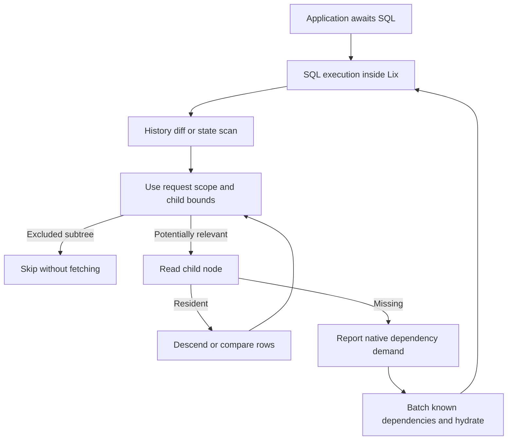

# E14: prune tree subtrees using query scope

**Accepted for large wide-history gains.** File-history queries already identify
file owners, but tree traversal can still read unrelated subtrees before filtering
rows. E14 applies a shared request-overlap predicate before those child reads in
scans, one-sided diffs, and both ordered frontiers of two-sided diffs.

The predicate retains explicit-schema ranges. When schema is unspecified, it
uses canonical schema-owner prefixes only if both child boundaries belong to one
schema. Mixed-schema and undecodable boundaries descend conservatively. Null
owners remain eligible for directory-path changes. Pending leaf windows survive
pruning so shifted tree boundaries retain ordered diff semantics.

No schema inventory, endpoint, persistent index, or application API is added.
This is additional filter logic for performance, not a claim that the entire
architecture becomes simpler. SQL retries and transport dependency layers remain.

## Profiling evidence

Caller probes on E13 wide-sparse history recorded 629 direct tree-node read
failures across 616 distinct hashes, all in two-sided `diff_nodes`. Setup recorded
466 failures across 374 hashes in `scan_node`; absent-file history recorded 64/64
in `diff_nodes`. These are failed-read counts, not HTTP request counts: batching
and retries differ. Raw compressed diagnostic logs, instrumentation patch, harness
and artifact metadata are archived. Diagnostic timings include logging and are
not acceptance evidence.

## Paired results

Ten alternating E13/E14 pairs per case use identical persisted synthetic fixtures,
fresh RocksDB partial replicas, real HTTP, and ordinary awaited SQL. Each run
checks ordered results against the authority and verifies covered history offline.
No compilers or tests ran during timing. Dense LIMIT2 includes all twenty pairs
after an inconclusive opening control; original and extra blocks are retained.
Positive values mean faster; intervals use 10,000 seeded bootstrap resamples of
paired relative improvements.

| Query | Native requests E13 → E14 | Median history ms E13 → E14 | Improvement [95% interval] |
| --- | ---: | ---: | ---: |
| dense4, full, 0 ms | 10 → 10 | 75.2 → 75.2 | 0.47% [-0.95%, 1.61%] |
| dense64, full, 0 ms | 29 → 29 | 858.6 → 869.2 | -1.18% [-3.37%, 0.22%] |
| sparse64, full, 0 ms | 20 → 20 | 287.1 → 288.8 | -0.61% [-1.48%, 1.10%] |
| absent64, full, 0 ms | 14 → 14 | 169.9 → 170.6 | -0.53% [-3.31%, 0.85%] |
| wide16000, wide, 0 ms | 337 → 21 | 3722.2 → 155.9 | 95.81% [95.76%, 95.83%] |
| wide_sparse64, wide, 0 ms | 404 → 46 | 14168.4 → 808.0 | 94.29% [94.25%, 94.32%] |
| blob8m, wide, 0 ms | 10 → 10 | 74.4 → 74.4 | -0.46% [-2.31%, 0.51%] |
| dense64, limit1, 0 ms | 4 → 4 | 31.9 → 32.7 | -1.48% [-6.42%, 0.18%] |
| sparse64, limit1, 0 ms | 9 → 9 | 75.3 → 74.9 | 0.48% [-1.78%, 3.17%] |
| wide_sparse64, limit1, 0 ms | 23 → 23 | 195.3 → 204.4 | -4.88% [-5.55%, -3.84%] |
| absent64, limit1, 0 ms | 14 → 14 | 181.0 → 180.8 | 0.19% [-2.65%, 2.07%] |
| dense64, limit2, 0 ms | 7 → 7 | 55.1 → 55.8 | -1.23% [-4.98%, -0.16%] |
| sparse64, limit2, 0 ms | 11 → 11 | 101.6 → 101.8 | -0.55% [-3.73%, 3.79%] |
| dense64, limit4, 0 ms | 10 → 10 | 83.8 → 83.3 | 0.70% [-1.22%, 2.60%] |
| sparse64, limit4, 0 ms | 14 → 14 | 150.2 → 152.2 | -1.06% [-3.47%, 0.78%] |
| dense64, full, 25 ms | 29 → 29 | 1892.9 → 1898.3 | -0.17% [-0.85%, 0.53%] |
| sparse64, full, 25 ms | 20 → 20 | 918.6 → 918.8 | -0.29% [-0.67%, 1.08%] |
| wide16000, full, 25 ms | 337 → 21 | 13969.3 → 743.2 | 94.67% [94.66%, 94.70%] |

Ordinary wide-history native bytes decrease 1,164,064 → 55,884; wide-sparse bytes
decrease 2,291,787 → 1,200,939. Other standard full/limited request and byte counts
remain unchanged. Wide warm-history queries improve 67.20% [66.43%, 68.49%] and
26.40% [25.50%, 27.15%], respectively.

There is a real small tradeoff: wide-sparse LIMIT1 is 4.88% slower [3.84%, 5.55%]
with unchanged 23 requests and 238,747 bytes. Dense64 first warm history at zero injected delay is 2.26%
slower [0.34%, 3.47%]. These costs remain below the 10% material-regression threshold;
not every metric improves. E11's earlier first-covered-query cost remains in the
baseline and is not claimed to be eliminated.

The initial dense LIMIT2 file-selection interval was [-10.018%, +4.240%].
Combining all twenty pairs gives -4.64% [-8.08%, 0.71%]. All final opening, file-selection, history and warm-query latency controls exclude a slowdown greater than 10%.

Opening remains two foreground requests and zero native reads in every archived
measurement. These are tested-size controls, not universal timing guarantees.
Exact-path file selection still costs roughly 6.4–6.7 seconds in the wide fixtures:
its complete filesystem-index construction remains a separate bottleneck.
Wide-sparse history at 25 ms was not measured; do not infer a measured latency
interval for that combination.

## Validation and architecture boundary

The exact engine source passes 4,325 tests (84 skipped) with
`cargo nextest run -p lix --features all-simulations,server-protocol`, ten doctests
with `cargo test -p lix --doc`, engine-package formatting, whitespace and
repository documentation validators. Canonical-Memory tests compare filtered
scans and both-direction/one-sided diffs with ordered maps across multiple schemas,
escaped keys, null/multiple/Any/absent owners, and shifted leaf boundaries. A
second test proves scoped reads need not hydrate excluded leaf chunks, while
unfiltered reads still require them.

A parent still has to be available before its child addresses are known. Pruning
removes irrelevant subtrees. Batching still follows that dependency order. Protocol and storage formats are unchanged, so this experiment
adds no migration requirement. The overall optimization goal remains active and
the consecutive-non-improvement streak remains zero.

## Reproduce

Build the archived extended harness through `tooling/Cargo.toml`, `lix_e2e`,
`server-protocol`, `profile.dev.package.lix.opt-level=2`, and `CARGO_INCREMENTAL=0`.
Both compared engines must use the same extended harness. Use
`../paired_history.py`, ten pairs and shared fixture files. Set
`LIX_PROFILE_HISTORY_LIMIT` for limited cases and `--rtt 25` for delayed-network cases. The manifest records exact source,
executable and harness hashes; raw measurements and summaries are included.
