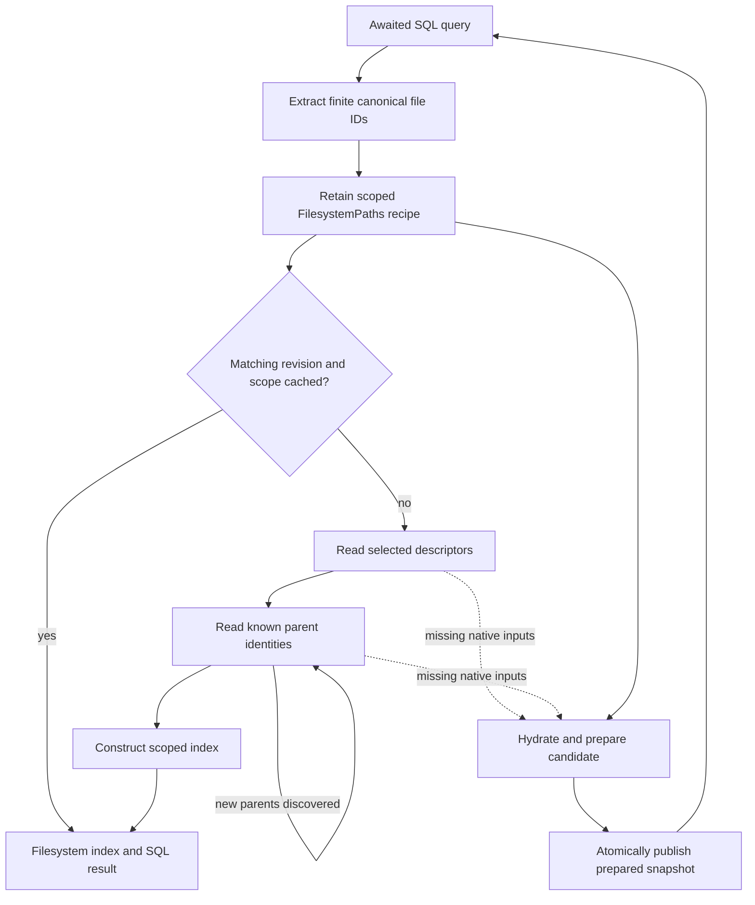

# E16: scoped filesystem indexes and ancestor reads

**Original decision: rejected; revised by [E17](../e17/README.md).** E17 attributes the warm-history difference to CPU execution conditions and accepts the combined implementation after corrected controls. The original report below is retained as the decision record.

**At E16 publication: rejected.** Finite-ID indexes produce large cold-selection gains, but every tested follow-up variant has a repeatable warm-history regression on the wide fixture after latency-injected hydration. This draft retains the prototypes and measurements; it applies no engine change. Consecutive substantive non-improvements: **2** (E15 and E16). The E16 variants are one experiment, not separate streak entries.

## Decision and paired results

The strongest combined variant improves cold selection by 28.41% on dense64, 91.41% with 1,600 unrelated directories, and 99.56% with 16,000 files at zero injected latency. It reduces the deep64 slowdown below the 10% material-regression threshold. However, its subsequent offline warm-history query is **25.69% slower** after the 25 ms-latency run: median **5.9365 → 7.4540 ms**, paired 95% interval **22.97–29.89% slower**. This control prevents acceptance.

Ten alternating pairs per fixture and RTT, identical persisted synthetic snapshots, matching deep harness `073bc9aff3e71d2c249db454a5fc31c5325a5cdb679a647f82e41518cf24210f`. Positive percentages mean faster; intervals are seeded 10,000-resample paired bootstrap intervals. These are local Linux/RocksDB/loopback HTTP measurements with engine optimization level 2, not browser or production latency guarantees.

| Combined variant vs accepted E14 | Cold lookup, 0 ms RTT | Cold lookup, 25 ms RTT |
|---|---:|---:|
| dense64 | +28.41% [+23.61, +31.24] | +29.66% [+29.11, +30.08] |
| dirs1600 | +91.41% [+91.22, +91.54] | +77.79% [+77.67, +77.83] |
| wide16000 | +99.56% [+99.54, +99.56] | +96.69% [+96.68, +96.70] |
| deep4 | +29.92% [+17.16, +33.81] | +27.41% [+26.99, +27.85] |
| deep16 | +16.03% [+10.10, +19.18] | +27.08% [+26.69, +27.48] |
| deep64 | -6.22% [-8.56, -3.74] | +24.94% [+24.63, +25.16] |

| Wide offline warm history after 25 ms hydration | Baseline → candidate median | Paired improvement, 95% interval |
|---|---:|---:|
| exact | 5.9015 → 7.4130 ms | -25.85% [-27.38, -24.62] |
| pushdown | 6.0320 → 7.3760 ms | -22.65% [-26.11, -14.10] |
| shared-root | 5.8895 → 7.3605 ms | -25.66% [-26.66, -24.77] |
| combined | 5.9365 → 7.4540 ms | -25.69% [-29.89, -22.97] |

The warm-history regression occurs while native requests are forbidden by the harness. At zero injected latency, these same variants improve wide warm history by roughly 2%. The difference is sensitive to the preceding hydration sequence. Its cause is **not established**; the data do not justify attributing it solely to decoding, cache lifetime, or CPU scheduling.

Other controls are retained rather than hidden: combined dense64 warm file lookup at RTT0 has an inconclusive interval [-15.13%, +0.33%], and deep16 warm file lookup is 7.01% slower with interval [1.31%, 9.93% slower]. Extra small/deep-case pairing was queued to clarify these controls, then canceled before starting once the repeatable wide-history failure made the acceptance decision conclusive. The extra-pair and query-smoke scripts are retained as **unexecuted plans**, not validation evidence.

## Variants and architectural tradeoffs

1. **Scoped index (v1):** keep the existing filesystem index and revision cache, but key them by finite canonical file IDs. Read selected descriptors and only their ancestors. This avoids all unrelated directories and files, unlike rejected E15. Dense/dirs/wide cold gains are substantial, but general ancestor scans make deep16 18.45% slower and deep64 89.69% slower at RTT0.
2. **Exact ancestors:** replace general scans with existing correlated, visibility-aware exact-row batches. Compared with v1, deep4/16/64 cold lookup improves 23.68%/29.11%/41.31%, and native requests fall 16 → 13. Compared with E14, deep64 still regresses 14.11% at RTT0.
3. **Pushdown:** add an internal parent-closure reader operation that resolves visibility once, then reuses exact materialization per frontier. Direct gains over exact reads are 2.16%/0.75%/5.00%, with intervals crossing zero. Deep64 vs E14 is inconclusive at -2.66% [-12.77%, -1.09%]. This adds an interface without establishing a standalone >10% gain.
4. **Shared root reader:** retain the tracked-state context already passed to HotStateContext instead of constructing one on each root cache miss. Reuse its verified encoded-byte LRU; it does **not** cache decoded nodes. Direct deep64 gain over exact reads is 4.53% [0.52%, 9.75%], while deep64 vs E14 still regresses 13.49%.
5. **Combined:** combine visibility pushdown and shared tree-byte caching. Deep64 improves 10.35% [8.55%, 14.23%] against exact reads and is 6.22% slower [3.74%, 8.56% slower] than E14. It clears the material deep-path regression but still fails the wide warm-history control.

All variants add optional scope to the index request, cache key, and retained dependency recipe. Scoped cache entries are evicted on filesystem revision changes; complete indexes keep their existing delta-update path. Transaction overlays still construct a complete index. Noncanonical ID literals and exact path queries keep their existing selection routes. These are performance experiments, **not an overall architecture simplification**.

The shared-root variant reuses an existing cache, with 4,096 entries and a 16 KiB encoded-node admission cap (about 64 MiB payload, excluding metadata and live views). This retains bytes across requests; immutable content hashes allow reuse while mutable visibility is re-evaluated. No public API, protocol version, storage-format change, manual reset, or migration is introduced by these prototypes.

## SQL dependency discovery

The recipe retains the semantic dependency, including future matching files and changed ancestry. Concrete identities discovered today are a hydration frontier, not a replacement for that recipe. Batching combines known identities at a frontier; it cannot discover an unknown parent's parent before reading its row. Pushdown can reduce repeated local preparation without changing that data dependency. A server closure or stored ancestry could reduce depth-dependent rounds, but would add authority work, indexing/write amplification, and completeness/visibility contracts; those are not implemented or measured here.

## Correctness and provenance

- Exact, pushdown, corrected shared-root, and combined variants each pass **4,331 engine tests**, 84 skipped, with `all-simulations,server-protocol`; each also passes **10 doc tests** and scoped formatting. The final v1 gate also passes 4,331 tests.
- Canonical Memory tests cover scoped ancestor selection, root/missing files, cache scope separation and revision invalidation, legacy recipe decoding, finite-ID SQL in base/rebuild simulations, existing indexed-read capture, and remote ancestor rename/new matches through preparation, atomic publication and reopen.
- Every timed invocation compares complete ordered file rows and history rows with its authority, then repeats covered queries offline. The pair runner matches snapshot digest, query mode, row count, history limit and result fields; it does not compare a separate cross-engine digest of file rows. History uses LIMIT 1.
- The original v1 eight-mode file query smokes ran successfully. Follow-up variants did not run a new eight-mode smoke suite; the final combined suite was canceled before starting after rejection.
- Opening remains bounded; see `opening-verification.json` for the independently audited completed exact/pushdown/shared/combined accepted-baseline pairs.
- The first shared-root test attempt reused a previous main-workspace test binary in the common Cargo target directory because the new worktree source timestamps were older. Its logs are explicitly named `stale-artifact` and **excluded**. The pipeline was stopped before benchmark build, source mtime advanced without changing bytes, and a correct source rebuild passed the full suite. Earlier exact/pushdown focused logs record their own compilation. Benchmark library IDs differ across worktrees and their artifact metadata is retained.
- The combined candidate source patch is `b2323b6011521d1cae4d0e18e283760c5c9f6a9faa542ba049456f32a1e1edbb`; its binary hash is `d956bf6b1cc126ada78a7e865a637af7d95ddbab5d865fc550c6eb5f38abb927`. Engine base: `0b46fb063ac28610cef9ee11d9dc528fdcef7eb5`. Patch archives reproduce each variant against that base.

## Reproduction and next experiment

Patch an isolated checkout of the recorded engine base, use the recorded harness, and build the benchmark through `tooling/Cargo.toml` with engine opt-level 2 and `server-protocol`. `save_build_binary.py` records the actual compiler artifact and hash. The retained orchestration scripts contain machine-local paths; adapt those paths to the checkout. Do not run compilers or tests during paired timing. For main-workspace tests using a shared target directory, force source freshness when switching worktrees or use isolated targets.

The next useful experiment is phase attribution of the wide warm-history difference, with repeated warm queries and controlled idle time after hydration, before another architectural change. Existing `root-replay-trace` counters can separate storage reads, hash verification and decoding; instrumented diagnostics must remain separate from uninstrumented A/B timings. This is a proposed follow-up, not a measured result.
