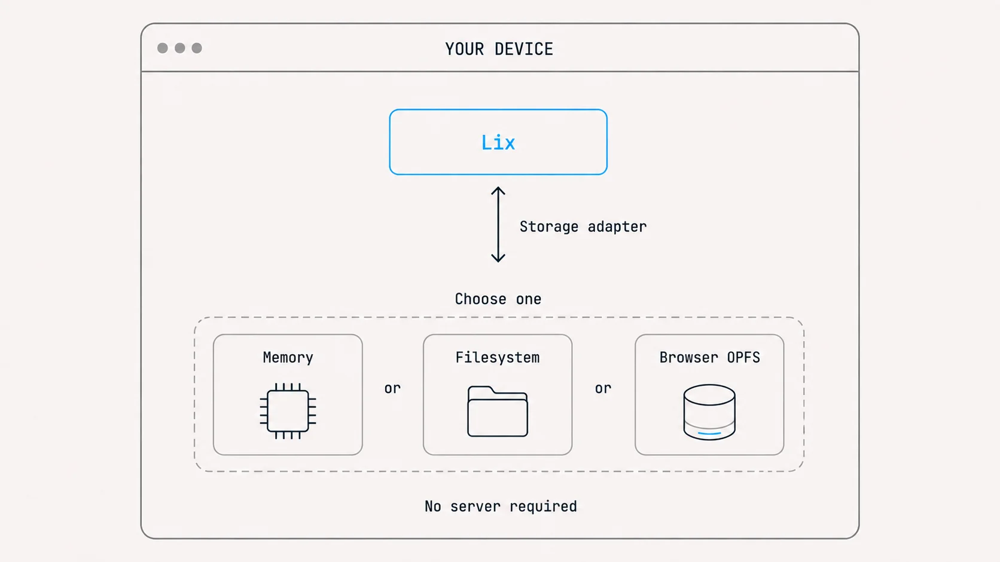
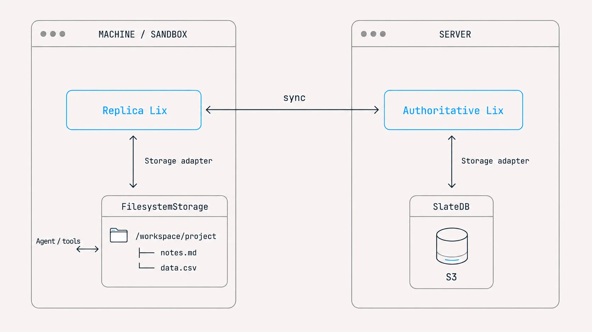
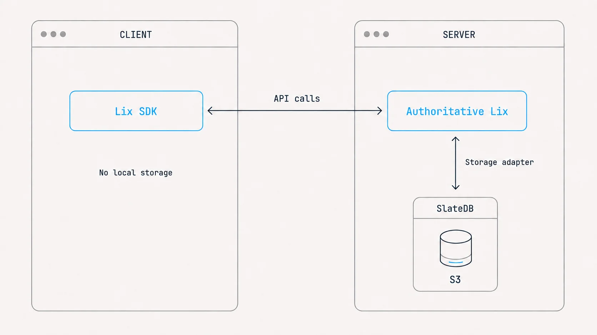
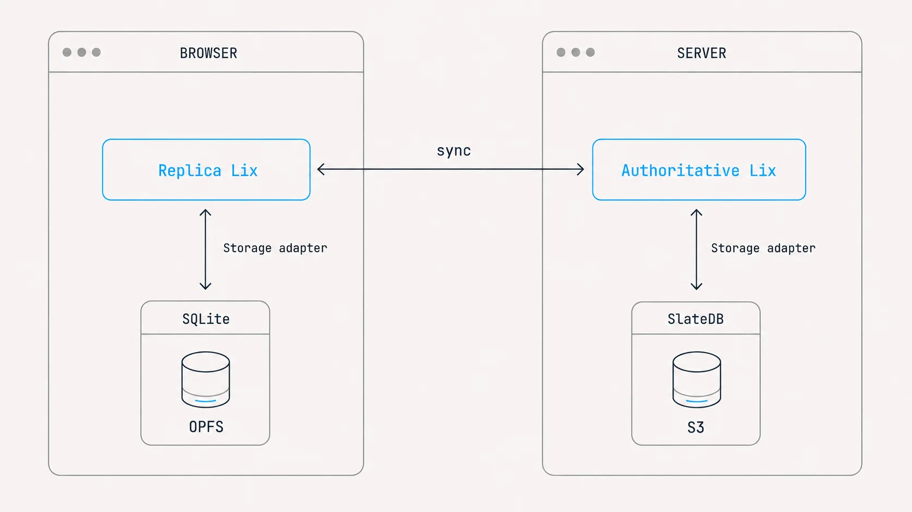

# Storage

Lix runs in memory by default. Choose a storage adapter when you need to keep
data across restarts. Files, SQL, and version control use the same API.



## In-memory (default)

<a id="local-only-storage"></a>

Start with `openLix()` and no options. Data lives in memory for the lifetime of
the instance, making this useful for tests and trying Lix:

```ts
import { openLix } from "@lix-js/sdk";

const lix = await openLix();
// ... use it ...
await lix.close();
```

## Local filesystem

Use [`@lix-js/storage-filesystem`](https://www.npmjs.com/package/%40lix-js/storage-filesystem)
in Node.js to persist a directory. Agents and tools can read and write its
ordinary files:

```ts
import { openLix } from "@lix-js/sdk";
import { FilesystemStorage } from "@lix-js/storage-filesystem";

const lix = await openLix({
  storage: new FilesystemStorage({ path: "./repository" }),
});
```

Lix stores repository state in `<repository>/.lix/.internal`. Keep that state
with the directory to reopen it. Only regular files synchronize; symlinks and
special entries are excluded.

For selective sync, pass `syncAllFiles: false` and import paths with
`storage.importPaths(paths)`. See [Rust usage](#rust-filesystem-adapter) below.

### Filesystem sync

<a id="sync-a-filesystem-with-a-server"></a>

Sync mode runs a local Lix replica alongside the authoritative server.
Use `FilesystemStorage` for project directories or mounted sandbox volumes.
It keeps ordinary files synchronized with the replica, which exchanges commits
with the server in the background.



```ts
import { openLix } from "@lix-js/sdk";
import { FilesystemStorage } from "@lix-js/storage-filesystem";

const lix = await openLix({
  storage: new FilesystemStorage({ path: "/workspace/project" }),
  server: {
    url: "https://example.com/lix/01936f4e-7b6c-7c3d-8f9a-123456789abc",
  },
});
```

Point `path` at the directory your infrastructure mounts into the sandbox.
Each machine keeps its own replica. Share a branch to exchange changes, or
use separate branches for review. See
[opening and reconnecting](./collaboration-and-sync.md#opening-and-reconnecting)
for initial downloads and offline behavior.

## Remote mode

<a id="client-server"></a>

<a id="use-a-server-without-local-storage"></a>

<a id="connect-to-a-server"></a>

A classic client-server setup: your app sends requests through the Lix SDK,
and the server executes them against its repository. Pass `server` without `storage`.
Storage is managed on the server. Use [LixRay](https://lixray.com/docs) or
[your own host](./hosting.md), and replace the example URL with your Lix
connection URL.



```ts
import { openLix } from "@lix-js/sdk";

const lix = await openLix({
  server: {
    url: "https://example.com/lix/01936f4e-7b6c-7c3d-8f9a-123456789abc",
  },
});
```

Each operation requires a network round trip; successful writes are accepted
by the server. For ordinary files on disk, use [filesystem sync](#filesystem-sync).

## Browser OPFS

<a id="browser-sync"></a>

<a id="sync-a-browser-with-a-server"></a>

`OpfsStorage` persists Lix in the browser across reloads. Add `server` alongside `storage`
to keep that local replica synchronized with a server.

Certified current-state reads can use local data. Mutations and history execute
on the server; the replica receives certified updates. Uncached data and reads
requiring a newer certificate can require a network fetch.



```ts
import { openLix } from "@lix-js/sdk";
import { OpfsStorage } from "@lix-js/storage-opfs";

const lix = await openLix({
  storage: new OpfsStorage({ name: "acme" }),
  server: {
    url: "https://example.com/lix/01936f4e-7b6c-7c3d-8f9a-123456789abc",
  },
});
```

Install [`@lix-js/storage-opfs`](https://www.npmjs.com/package/%40lix-js/storage-opfs).
SQLite Wasm persists the replica in the browser's Origin Private File System
(OPFS). Reuse `name` within the same browser origin to reopen it after reloads.
Omit `server` for a browser-only repository. Workers and tabs can share the
same name through the package's storage worker and cross-tab Web Lock.

Both sync setups download current working state on first open. Existing
replicas reopen locally; older history and binary content load when needed.
Mutations require server acceptance. See
[opening and reconnecting](./collaboration-and-sync.md#opening-and-reconnecting).

## How storage adapters fit

The client configures its local adapter with `storage`. The host configures
server storage. In the diagram, SlateDB runs inside the server process and
uses S3 as its external backing store.

| Adapter | Available in | Stores data in |
| --- | --- | --- |
| `Memory` (default) | JavaScript, Rust | Temporary in-memory data |
| `FilesystemStorage` | JavaScript (Node.js), Rust | Files and repository state on disk |
| `OpfsStorage` | JavaScript (browser) | Browser OPFS through SQLite Wasm |
| `RocksDB` | Rust | Local disk for native embedded persistence |
| `SlateDB` | Rust | S3-compatible object storage |

The [reference server](https://github.com/opral/lix/tree/main/packages/server)
uses SlateDB; custom hosts can choose another adapter. The separate `server`
option controls remote execution or replica synchronization. See the
[connection reference](./collaboration-and-sync.md#connection-reference).
JavaScript sync clients require a durable adapter, such as `OpfsStorage` or
`FilesystemStorage`. Use [Snapshots](./snapshots.md) to export or restore a
complete repository.

### Rust filesystem adapter

In Rust, start directory synchronization explicitly:

```rust
use lix::open_lix;
use lix_storage_filesystem::FilesystemStorage;

let storage = FilesystemStorage::new("./repository").open()?;
let lix = open_lix().with_storage(storage.clone()).await?;
storage.start_sync(&lix).await?;

storage.sync_disk_to_lix().await?;
storage.stop_sync().await?;
```

The adapter owns directory synchronization after `start_sync()`. Stop it before
immediately reopening the directory; dropping the final instance attempts
shutdown.

## Automatic format upgrades

Opening a supported older format copies it into an inactive storage epoch,
validates it, then atomically publishes it. No separate migration call is
needed. Report progress with Rust's `OpenProgressSink` or JavaScript's
`onProgress`.

Lix retains the previous generation for rollback. Budget roughly 2× the live
repository size plus WAL, compaction, and temporary-write space. Upgrade time
depends on data size, storage, and hardware; available capacity is the practical
limit. Later upgrades reuse the inactive epoch and reclaim legacy storage
asynchronously.

Run the RocksDB capacity profile against a released-v75 repository:

```sh
LIX_MIGRATION_PROFILE_MIB=256 cargo test -p lix-storage-rocksdb \
  --features storage-benches --test migration_profile --release -- \
  --ignored --nocapture
```

## Closing

Always `await lix.close()` in scripts and tests. Long-lived servers can hold one Lix instance for the process lifetime.

## Custom storage (Rust)

Adapters implement ordered transactional key-value storage, without parsing
Lix SQL or interpreting branches and changes.

Implement three asynchronous traits from `lix::storage`: `Storage`, `StorageRead`, and `StorageWrite`. An implementation must guarantee:

1. **Space isolation.** Keys in different spaces never collide.
2. **Coherent read views.** A read handle observes one coherent view for its lifetime.
3. **Ordered scans.** Scans return keys in ascending byte order.
4. **Atomic commits.** A commit publishes all staged mutations or none.
5. **Persistence.** Persistent implementations define their durability boundary. `Memory` is ephemeral.

Validate an implementation with the public conformance suite:

```rust
use lix::storage::conformance::run_storage_conformance;

let report = run_storage_conformance(&factory).await;
report.assert_no_failures();
```

Backends without an existing adapter, such as PostgreSQL or Cloudflare D1,
need such an implementation.
