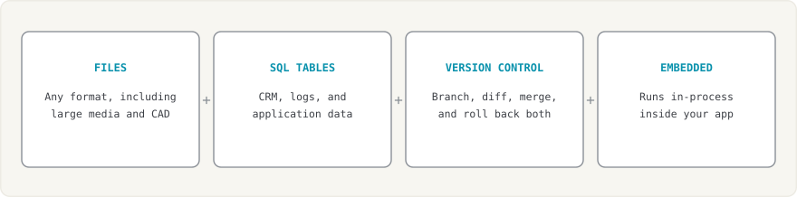
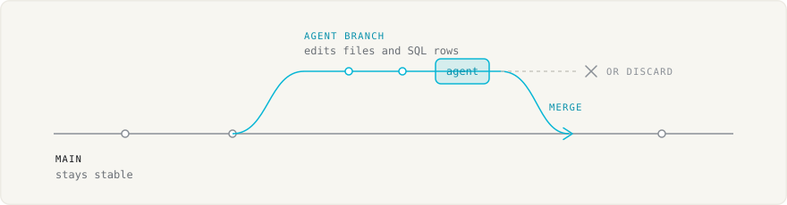
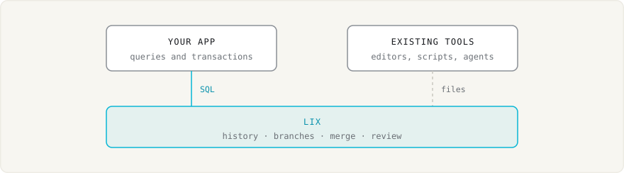
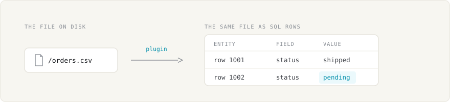
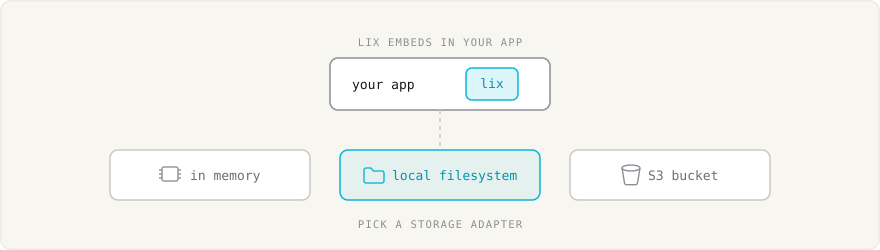

# What is Lix?

Lix is a **version control system for files and data beyond code**. It combines files, a database, and version control in one system.

Lix is an embeddable library, not a CLI. Tools and agents work with normal files. Apps query and update SQL rows. Lix tracks every change with branches, history, review, rollback, and merge.

Unlike Git, Lix tracks the entities inside files, not lines of text. See [How Lix compares to Git](./comparison-to-git.md).

## Prime use cases

### Safe repositories for agents

Give each agent task its own branch. The agent can edit files and SQL rows without changing the main branch. Preview the result, then merge or discard it.

See [Lix for AI Agents](./lix-for-ai-agents.md).

### File-based apps with SQL and version control

Build editors, knowledge bases, document workflows, and other file-based apps. Existing tools keep using files while your app uses SQL for queries and transactions. Lix adds history, rollback, branches, merging, and review.

## Files become queryable rows

File plugins map parts of a file to rows. A row can represent a Markdown block, CSV record, spreadsheet cell, JSON property, or document clause.

Apps read and write these rows with SQL. Lix records their history. With
`LocalFilesystem`, it also writes changes back to normal files on disk.

Diffs are semantic: review the clause, cell, or row that changed, not lines of text. See [Semantic Changes](./semantic-changes.md).

The JavaScript SDK includes Markdown and CSV plugins. Other formats, including JSON, XLSX, DOCX, and PDF, need a plugin.

App data does not have to come from a file. Register a schema, and Lix creates a SQL table with the same history and branches.

## Pluggable storage

Storage is pluggable. Run Lix in memory, on the local filesystem, or against a server backed by S3. This makes Lix easy to embed and scale. See [Persistence and Storage](./persistence.md).

## Local and remote

Lix supports local and remote repositories with the same API. Run it in your
process for a local repository or connect to a Lix server for a shared
repository. See [Persistence and Storage](./persistence.md) for setup examples.

Remote clients use the same files, SQL, branches, and live queries. Clients on
the same server see changes through `lix.observe()`. See
[Real-time Collaboration](./realtime-collaboration.md) for a two-client example.

## Permissions (in development)

Permissions are on the roadmap. They will live inside the repository: per file, per group, and versioned like any other change. A policy change can then be proposed, reviewed, and merged on a branch.

## Next

- [Getting Started](./getting-started.md): choose the JavaScript or Rust quickstart.
- [How Lix compares to Git](./comparison-to-git.md): files, databases, and version control side by side.
- [Schemas](./schemas.md): define app rows and plugin entities.
- [Semantic Changes](./semantic-changes.md): track changes inside files.
- [Files and Media](./files-and-media.md): store text, binary files, and large media.
- [Real-time Collaboration](./realtime-collaboration.md): connect two clients to one repository.
- [Persistence](./persistence.md): choose a local or remote setup.
