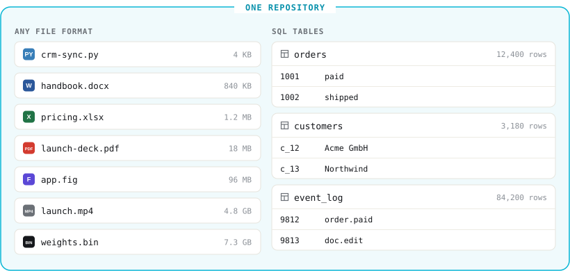

# What is Lix?

Lix is a version control system for files and tables. It stores any file format, including large media, CAD, Word, and PowerPoint, alongside SQL tables for CRM records, logs, and other application data. Files, tables, and history share one repository. Lix can run inside a product or connect to a server.

Code, documents, and application tables can share one history. A branch can carry related file and row changes for review before they become the current state. This gives teams a foundation for change proposals and, later, automated checks across more than code.

[Try Lix in the cloud →](https://lixray.com)

Agents and tools read and write normal files. Products query and update SQL rows. Both work on the same repository. Every tracked write becomes a commit automatically. You never run a commit command.

Lix versions tables that your app defines and writes through Lix. It does not automatically version tables in an external database. For supported file formats, plugins track changes inside files as rows. Other files still have whole-file history. See [How Lix compares to Git](./comparison-to-git.md).




## Use cases

### Co-locate code, documents, and app state

Code lives in Git. Documents, design files, and media live in Drive, Figma, and S3. App state lives in Postgres. Lix can put those files and app tables in one repository with one history.

```ts
// A script, a 4.8 GB video, and an app table in one transaction.
await lix.executeBatch([
  {
    sql: "INSERT INTO lix_file (path, content) VALUES ($1, $2)",
    params: ["/automations/weekly-report.js", source],
  },
  {
    sql: "INSERT INTO lix_file (path, content) VALUES ($1, $2)",
    params: ["/media/launch.mp4", video],
  },
  {
    sql: "UPDATE orders SET status = 'shipped' WHERE id = $1",
    params: [1002],
  },
]);
```

### Let agents propose changes

Give an agent a branch of the files and Lix-managed SQL tables it needs for a task. Your product can show the changed files and rows before merging the branch. This applies to data stored in Lix; external databases and SaaS tools are not versioned automatically. [LixRay](https://lixray.com) is a hosted repository built on Lix.

### Give each customer a repository

Your customers want agents that write automations and edit their documents, with a way to review and undo. Drive's file history does not cover your app's SQL tables. Embed Lix and give each customer a repository that holds their code, documents, spreadsheets, media, and app tables.


```ts
// One hosted repository per customer.
const lix = await openLix({
  server: {
    url: `https://example.com/lix/${customer.repositoryId}`,
  },
});
```

See [Hosting](./hosting.md).

### Sync files

Sync the files that agents and applications work on, between machines and with a server.


```ts
import { openLix } from "@lix-js/sdk";
import { FilesystemStorage } from "@lix-js/storage-filesystem";

// ./project stays a normal directory. Lix syncs it through the server.
const lix = await openLix({
  storage: new FilesystemStorage({ path: "./project" }),
  server: {
    mode: "partial_replica",
    url: "https://lixray.com/lix/01936f4e-7b6c-7c3d-8f9a-123456789abc",
  },
});
```

See [Collaboration](./collaboration-and-sync.md).

## Files become queryable rows

File plugins map parts of a file to rows. A row can represent a Markdown block, CSV record, spreadsheet cell, JSON property, or document clause. Markdown and CSV plugins ship with the JavaScript SDK. JSON, plain text, and Excalidraw plugins install with one SQL statement. See [Plugins](./plugins.md).


Apps read and write these rows with SQL. Lix commits their history. With `FilesystemStorage`, it also writes changes back to normal files on disk.

With a suitable plugin, you can review the block, property, or row that changed. Files without a plugin have whole-file diffs. See [Diffs](./diffs.md).

## Pluggable storage

Run Lix in memory, on the local filesystem, or against a server backed by S3. See [Storage](./persistence.md).


## Local, remote, and partial replica

Lix supports local repositories, direct remote clients, and partial replicas with the same API. See [Storage](./persistence.md) for setup examples.

Clients can execute directly on a server or use a partial replica. Both modes use the same files, SQL, and branches. Clients on the same server see each other's changes through `lix.observe()`. See [Collaboration](./collaboration-and-sync.md).

## Permissions (planned)

Permissions will live inside the repository: per file, per group, and versioned like any other change. A policy change can then be proposed, reviewed, and merged on a branch.

## Next

- [Getting Started](./getting-started.md): choose the JavaScript or Rust quickstart.
- [How Lix compares to Git](./comparison-to-git.md): files, databases, and version control side by side.
- [Schemas](./schemas.md): define app rows and plugin rows.
- [Diffs](./diffs.md): track changes inside files.
- [Files and Media](./files-and-media.md): store text, binary files, and large media.
- [Collaboration](./collaboration-and-sync.md): connect clients directly or through local replicas.
- [Storage](./persistence.md): choose a local or remote setup.
- [Plugins](./plugins.md): install plugins for more file formats.
