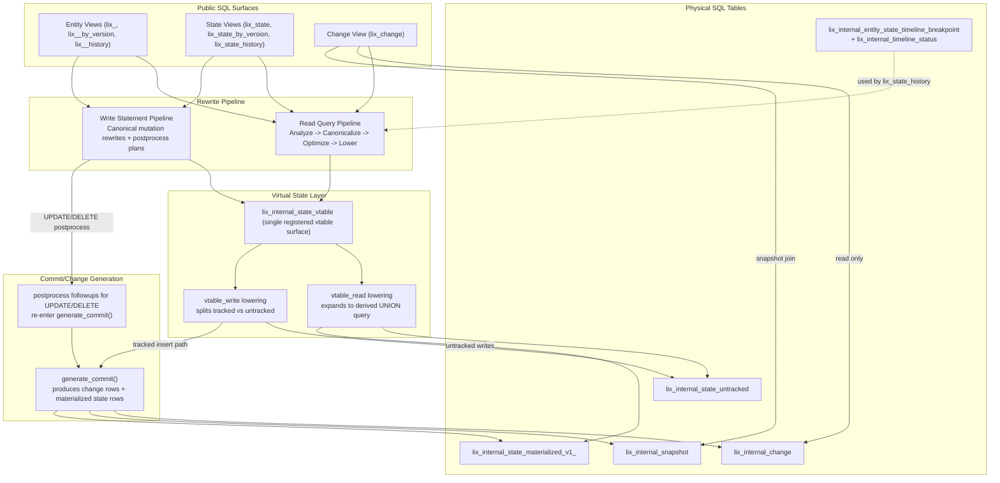

# Lix Engine Architecture (Current State)

This report describes how the current engine implementation works in code today, with focus on:

`entity views -> state views -> vtable -> changes -> physical SQL tables`

## 1) Architecture Diagram

## 2) Does your model match reality?

Short answer: mostly yes, with one important correction.

- `entity views -> state views -> vtable` is correct.
- `changes` is **not** strictly "below" vtable in read flow.
  - `lix_change` reads directly from `lix_internal_change` + `lix_internal_snapshot`.
  - vtable reads go to `untracked + materialized` state tables.
- On writes, tracked mutations generate both:
  - change log rows (`lix_internal_change` + `lix_internal_snapshot`), and
  - materialized state rows (`lix_internal_state_materialized_v1_*`).

So a more accurate model is:

- Reads: `entity/state views -> vtable -> materialized/untracked tables` and separately `lix_change -> change/snapshot tables`.
- Writes: `entity/state views -> vtable write -> commit generation -> (changes + materialized state)`.

## 3) How It Works Right Now

### 3.1 Public surfaces are mostly logical

Public table names are registered as API surfaces (including `lix_state`, `lix_state_by_version`, `lix_change`, filesystem/entity views), but most are rewritten rather than directly stored.

- Public registry: `packages/engine/src/lix_table_registry.rs`.
- Physical tables are created in init + schema registration, not as public `lix_*` tables.

### 3.2 Entity views are dynamic schema frontends

Entity view names are derived from schema keys (`lix_<schema>`, suffix `_by_version`, `_history`) and resolved from builtin/stored schema definitions.

- View name resolution and variants in `entity_views/target.rs`.
- Entity reads are thin wrappers over `lix_state`, `lix_state_by_version`, or `lix_state_history` with JSON property extraction and `lixcol_*` alias projection.
- Read wrappers still apply schema-declared lixcol overrides (for example fixed `file_id` / `plugin_key` and version-pinned base views) because core builtin schemas depend on those constraints.
- History wrappers preserve root/version predicate pushdown so `lix_state_history` can scope timelines correctly for non-active roots.
- Entity writes are rewritten into state-view mutations and construct `snapshot_content` from property assignments.

### 3.3 State views compile into effective-state queries over vtable

- `lix_state` is now a wrapper over `lix_state_by_version`:
  - read rewrite routes through `lix_state_by_version` with active-version filtering.
  - `version_id` is not exposed as a `lix_state` column.
- `lix_state_by_version` read rewrites to `build_effective_state_by_version_query(...)`.
- Visibility selection still uses ranking/window logic over `(entity_id, schema_key, file_id, version scope)`.

### 3.4 `lix_internal_state_vtable` is a rewrite surface, not a physical table

There is one registered vtable surface (`InternalStateVtable`) with read and write capability.

- Read lowering expands vtable references into a derived `UNION ALL` query across:
  - `lix_internal_state_untracked`
  - `lix_internal_state_materialized_v1_<schema_key>`
- Rows are ranked so untracked rows take precedence.

### 3.5 Write path: canonicalization + tracked/untracked split

Mutation flow (backend path):

1. Statement canonical rewrite loop (filesystem/entity/state/by_version/vtable).
   - `lix_state` mutation rewrites first normalize to a `lix_state_by_version` form with active `version_id`.
2. `vtable_write` split:
   - untracked rows -> `lix_internal_state_untracked` upsert
   - tracked rows -> domain changes -> `generate_commit(...)`
3. `generate_commit` emits commit metadata and domain materialization.
4. `commit_runtime` converts commit result into SQL inserts for:
   - `lix_internal_snapshot`
   - `lix_internal_change`
   - `lix_internal_state_materialized_v1_<schema_key>`
5. UPDATE/DELETE rely on postprocess followups to generate commit rows from RETURNING results.

### 3.6 `lix_change` is read-only and sourced from change/snapshot tables

`lix_change` queries are rewritten to:

- `FROM lix_internal_change ch`
- `LEFT JOIN lix_internal_snapshot s ON s.id = ch.snapshot_id`

and write attempts are rejected.

## 4) Physical SQL Storage Layers

Core persisted state/change layer:

- `lix_internal_state_untracked`
- `lix_internal_state_materialized_v1_<schema_key>` (dynamic per schema, created by `schema_registry`)
- `lix_internal_change`
- `lix_internal_snapshot`
- `lix_internal_commit_ancestry`

History acceleration layer:

- `lix_internal_entity_state_timeline_breakpoint`
- `lix_internal_timeline_status`

Additional caches/stores exist (file data/path caches, binary blob/chunk tables), but they are not the core state/change architecture.

## 5) Complexity Hotspots (for simplification)

Current hotspots:

1. Multiple rewrite stages and loops (query phases + statement rewrite passes).
2. Dual tracked pathways:
   - tracked INSERT path and
   - UPDATE/DELETE postprocess path,
   both converging later through commit generation.
3. Per-schema materialized tables improve index locality but increase operational complexity.
4. History (`lix_state_history`) has its own timeline-materialization subsystem.

## 6) Practical Simplification Directions

1. **Unify tracked write semantics**
   - Force INSERT/UPDATE/DELETE onto one `DomainChangeInput -> generate_commit -> statement batch` path.
   - Removes special-case divergence between immediate insert rewrites and postprocess followups.

2. **Collapse state mutation entrypoints** (implemented)
   - State writes are canonicalized to one version-explicit form (`lix_state_by_version` semantics).
   - `lix_state` remains a user convenience wrapper over active-version semantics.

3. **Introduce an explicit IR boundary**
   - Replace repeated AST rewrite passes with a typed intermediate representation (`ReadIntent` / `WriteIntent`) before SQL lowering.
   - Makes behavior easier to reason about and test.

4. **Optional medium-term storage simplification**
   - Evaluate whether per-schema materialized tables can be consolidated into one tracked-state table with selective/generated indexes.
   - Tradeoff: simpler architecture vs potentially weaker query/index specialization.

## 7) Source Map (key files)

- Public surfaces registry: `packages/engine/src/lix_table_registry.rs`
- Read rewrite phases: `packages/engine/src/sql/planning/rewrite_engine/pipeline/query_engine.rs`
- Canonical logical-view rewrites: `packages/engine/src/sql/planning/rewrite_engine/pipeline/rules/query/canonical/logical_views.rs`
- Entity view read/write lowering:
  - `packages/engine/src/sql/planning/rewrite_engine/entity_views/target.rs`
  - `packages/engine/src/sql/planning/rewrite_engine/entity_views/read.rs`
  - `packages/engine/src/sql/planning/rewrite_engine/entity_views/write.rs`
- State view read/write lowering:
  - `packages/engine/src/sql/planning/rewrite_engine/steps/lix_state_view_read.rs`
  - `packages/engine/src/sql/planning/rewrite_engine/steps/lix_state_by_version_view_read.rs`
  - `packages/engine/src/sql/planning/rewrite_engine/steps/lix_state_view_write.rs`
  - `packages/engine/src/sql/planning/rewrite_engine/steps/lix_state_by_version_view_write.rs`
- Vtable read/write:
  - `packages/engine/src/sql/planning/rewrite_engine/steps/vtable_read.rs`
  - `packages/engine/src/sql/planning/rewrite_engine/steps/vtable_write.rs`
  - `packages/engine/src/sql/vtable/registry.rs`
  - `packages/engine/src/sql/vtable/internal_state_vtable/capabilities.rs`
- Change view:
  - `packages/engine/src/sql/planning/rewrite_engine/steps/lix_change_view_read.rs`
  - `packages/engine/src/sql/planning/rewrite_engine/steps/lix_change_view_write.rs`
- Commit generation + runtime SQL batch:
  - `packages/engine/src/state/commit/generate_commit.rs`
  - `packages/engine/src/sql/history/commit_runtime.rs`
  - `packages/engine/src/sql/execution/followup.rs`
- Physical table initialization and schema table registration:
  - `packages/engine/src/init/mod.rs`
  - `packages/engine/src/schema/registry.rs`
